\break

\newpage

## Abstract
Content of the abstract.

\newpage

## Table of contents

[Abstract](#abstract)................................ i

[Table of content](#table-of-contents)....................................... 1

[List of Tables](#list-of-tables).................... 2

[List of Figures](#list-of-figures).................. 3

[List of Abbreviations](#list-of-abbreviations)...... 4

[List of Acronyms](#list-of-acronyms)................ 5

[List of Symbols](#list-of-symbols).................. 6

[Introduction - First Chapter](#introduction)......................... 7

[Second Chapter](#chapter-2)...... 8

[Bibliographic References](#references)....... 11

\newpage

## List of Tables
Content of the list of tables.

\newpage

## List of Figures

1. [Figure 1: Explanation of the MVT Architecture](#one)
2. [Figure 2: Explanation of CMMS](#explication-de-cmms)
3. [Figure 3: Illustration of Augmented Reality](#illustration-de-la-réalité-augmentée)

4. [Figure 4 : Example of OpenCv use](#example-opencv)

\newpage

## List of Abbreviations
- **CMMS**: Computerized Maintenance Management Systems

\newpage

## List of Acronyms
- **AR**: Augmented Reality
- **ORM**: Object-Relational Mapping
- **MVT**: Model-View-Template

\newpage

## List of Symbols
Content of the list of symbols.

\newpage

# Introduction

We are faced with the development of a full-stack website that requires tight integration between the backend and the frontend. The backend and frontend of our application will be developed using Django. It will be interconnected to a Computerized Maintenance Management System (CMMS) for effective management of maintenance operations. On the other hand, the frontend, also built with Django, will be linked to augmented reality (AR), an immersive technology that enriches the user experience by providing contextual information in real time. Our project has a direct link to the work presented in this article **[@ana2021augmented]  [[1]](#references)**. Our goal is therefore to make a link between the CMMS and the AR; in this figure, we will therefore take care of the server and the database. In this project, my role mainly focuses on frontend development.

The fusion of CMMS and AR presents several technical and logistical challenges. Achieving seamless communication and data flow between the backend server and the AR frontend poses a significant hurdle. Furthermore, ensuring real-time synchronization of data from the CMMS to the AR interface demands meticulous planning and execution. Additionally, the inherent complexity of AR integration necessitates a user-friendly frontend design without compromising functionality and performance.

The internship presents an unparalleled opportunity to explore the synergies between CMMS and AR technologies and deepen understanding of full-stack development. By focusing primarily on frontend development, the internship aims to bridge the gap between backend infrastructure and user interfaces. Moreover, the prospect of contributing to a project with real-world applications, as demonstrated in **[@ana2021augmented]  [[1]](#references)**, serves as a powerful motivator, underscoring the relevance and importance of our work.

\newpage

# Chapter 2
### What is Django?

Django is an open-source web framework written in Python, designed to simplify the development of complex and scalable web applications. Launched in 2005, Django is maintained by an active community of developers and is widely used in the industry to create a variety of web applications, ranging from simple websites to complex web platforms.

**Key features of Django:**

- **Full-stack Web Framework**: Django is a full-stack web framework, providing all the necessary tools to develop both the frontend and backend of a web application, including database management, business logic, URL routing, and form handling .
- **MVT Architecture (Model-View-Template)**: Unlike the MVC model, Django follows the MVT architecture where models represent application data, templates are responsible for presentation, and views contain the processing logic . 

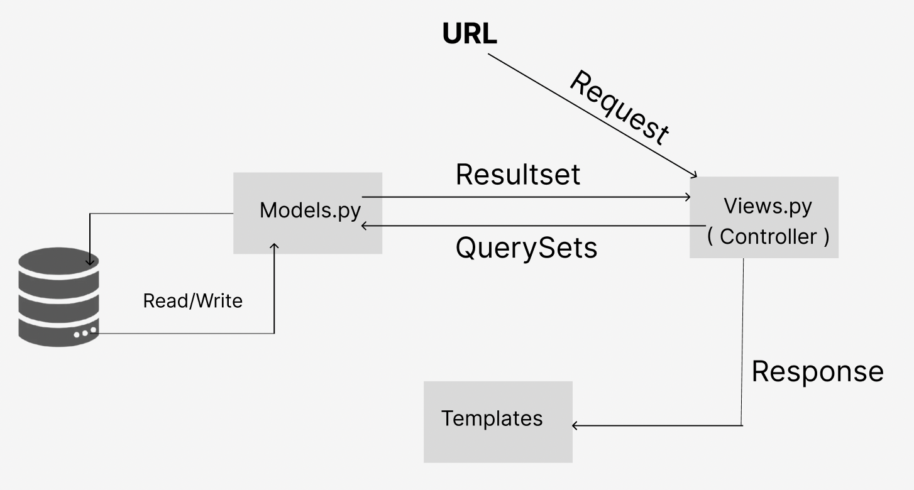 [Figure 1 - Explanation MVT](#list-of-figures)

- **ORM (Object-Relational Mapping)**: An ORM is a programming technique that allows mapping objects from an object-oriented programming language (such as Python, Java, etc.) to data stored in a relational database . Rather than writing SQL queries directly, the ORM allows developers to interact with the database using familiar objects and methods, thus facilitating application development and maintenance. In summary, an ORM abstracts the complexity of the relational database, allowing developers to work with data in a more object-oriented way.
- **URL Routing System**: Django uses a URL routing system that maps URLs to corresponding views, providing clean and efficient route management in the application .

- **Built-in Security**: Django comes with many built-in security features, such as protection against common security vulnerabilities like SQL injection attacks, cross-site scripting (XSS) attacks, and bypassing form validation.

- **Automatic Administration**: Django provides an automatically generated admin interface from the data models, allowing administrators to manage site content without needing to write specific code for it .

- **Batteries Included**: Django follows the "batteries included" principle, meaning it provides many ready-to-use features like user authentication, session management, pagination, static file management, and more .

- **Extensibility**: Django is highly extensible, allowing developers to add custom features to their application by using third-party packages or writing their own custom code .

### What is CMMS (Computerized Maintenance Management Systems)?
Computerized maintenance management systems (CMMS) are sophisticated software solutions deployed by organizations to effectively streamline their maintenance operations. These systems form the backbone of maintenance management, orchestrating various tasks such as planning, organizing, tracking and managing maintenance activities across the organization.

At the heart of a CMMS is a robust and comprehensive database, which acts as a centralized repository of vital information relating to the organization's maintenance operations. This database stores a wealth of data, including detailed equipment specifications, maintenance schedules, historical maintenance records, spare parts inventory and work order histories.

One of the key benefits of CMMS is its ability to empower maintenance technicians by providing them with instant access to relevant information needed to perform their tasks accurately. Using the CMMS interface, technicians can quickly identify equipment requiring maintenance, view detailed maintenance procedures, and determine the availability of required spare parts. This streamlined access to information not only improves the efficiency of maintenance activities, but also helps minimize downtime by ensuring timely maintenance interventions.

In addition, CMMS plays a crucial role in facilitating informed decision-making at the managerial level. By analyzing the data stored in the CMMS database, managers can gain valuable insights into the performance of their maintenance operations. They can track key performance indicators, identify trends and forecast maintenance needs, enabling them to make data-driven decisions regarding resource allocation, budgeting and strategic planning. For example, managers can calculate the financial implications of repairing machine breakdowns versus preventative maintenance measures, thereby optimizing maintenance budgets and improving operational efficiency.

In summary, CMMS is a powerful tool for effectively managing a company's maintenance resources. By centralizing maintenance-related information, streamlining processes and providing valuable insights, CMMS enables organizations to optimize their maintenance operations, minimize downtime, reduce maintenance costs and, in turn, ultimately drive overall organizational performance and market competitiveness. But although it is very effective and useful for businesses it nevertheless remains very complex, as this article explains **[@mather2002cmms] [[2]](#references)**

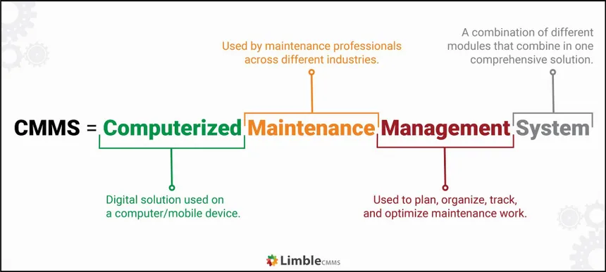  [Figure 2 - Explanation CMMS](#list-of-figures) Source : limblecmms.com/ZGl1bV9WMl8xOTgw/JUUyJTgwJThBJ  Last search : 24/04/2024

### What is Augmented Reality?

Augmented Reality (AR) is a revolutionary technology that overlays virtual elements such as images, videos, or 3D models onto the real world, typically through an electronic device such as a smartphone, tablet, or smart glasses. Unlike Virtual Reality (VR), which creates an entirely virtual environment, AR enhances and improves the real environment by adding digital information in real time.

Augmented reality applications can take various forms, offering a wide range of uses. They can serve as product visualization tools, allowing consumers to virtually try out products before purchasing them. Additionally, they can be used in interactive games that blend the real world and the virtual world, providing immersive and innovative gaming experiences. In the field of education, augmented reality can be used as an interactive learning tool, allowing learners to explore subjects in a more engaging and practical manner. Similarly, in the field of assistance, it can provide step-by-step guides to help users perform complex tasks, such as repairing electronic devices or navigating unfamiliar environments.

In summary, augmented reality offers significant potential to transform our interaction with the world around us, providing rich and immersive experiences in many areas, ranging from entertainment to education to commerce and industry.

  [Figure 3 - AR Illustration](#list-of-figures) Source : gettyimages.fi/ZGl1bV9WMl8xOTgw/JUUyJTgwJThBJ  Last search : 24/04/2024

### Integration of Augmented Reality into Maintenance

The integration of Augmented Reality (AR) into maintenance operations signifies a remarkable advancement in optimizing industrial processes. By harmonizing the sophisticated functionalities of Computerized Maintenance Management Systems (CMMS) with the immersive capabilities of augmented reality, companies can curtail unplanned downtime and enhance overall operational efficiency. Through AR, maintenance technicians gain access to real-time contextual information seamlessly integrated into their field of vision, empowering them to conduct inspections and repairs with unprecedented precision. For instance, utilizing augmented reality glasses or headsets, a technician can effortlessly visualize critical data such as electrical schematics, technical specifications, or repair instructions overlaid onto the actual equipment, thereby diminishing the reliance on traditional paper manuals or digital documents on laptops and enabling faster and more precise interventions. Additionally, AR facilitates interactive step-by-step guides for intricate maintenance procedures, mitigating the risk of human errors and elevating the quality of repairs. By seamlessly integrating augmented reality into the existing framework of maintenance management systems, companies not only modernize their maintenance processes but also ignite innovation and fortify their competitive stance in the market.

A tangible application of AR in maintenance is illustrated in the article by **[@henderson2010exploring] [[3]](#references)**. They devised a prototype aimed at assisting military mechanics in executing routine maintenance tasks within an armored vehicle turret. The prototype employs a head-mounted display to augment a mechanic's natural view with text, labels, arrows, and animated sequences, tailored to enhance comprehension, localization, and task execution. A qualitative survey conducted revealed that mechanics found the augmented reality conditions intuitive and satisfactory for the tested task sequence.

Expanding on this momentum, a recent empirical study by **[@fiorentino2014augmented] [[4]](#references)** was conducted to assess the efficacy of technical maintenance aided by interactive instructions in augmented reality. This study introduces an innovative methodology incorporating augmented visualization on a large screen in conjunction with a fusion of multiple fixed and mobile cameras, leveraging commercially available solutions. During the experiment, 14 participants undertook a series of four maintenance tasks centered on manual inspections of a motorcycle engine. With augmented instructions providing support through visual labels, 3D virtual models, and animations, participants executed tasks such as tool selection, bolt removal, and part disassembly. Comparisons were drawn between traditional paper textbooks and augmented instructions. Results of rigorous statistical analyses unequivocally demonstrated that augmented instructions significantly reduced overall execution time and participant error rates, thereby underscoring the transformative potential of AR in optimizing maintenance processes.

To be even more concrete, we're going to look at a method of implementing augmented reality using Python . We're going to take a look at an Open CV Python library. This library was originally developed by Intel, which specializes in real-time image processing. The robotics company Willow Garage, followed by ItSeez, have since supported this library.
The library provides a wide range of functions for creating programs from raw data to basic graphical interfaces. The software can also be used to develop facial recognition methods.

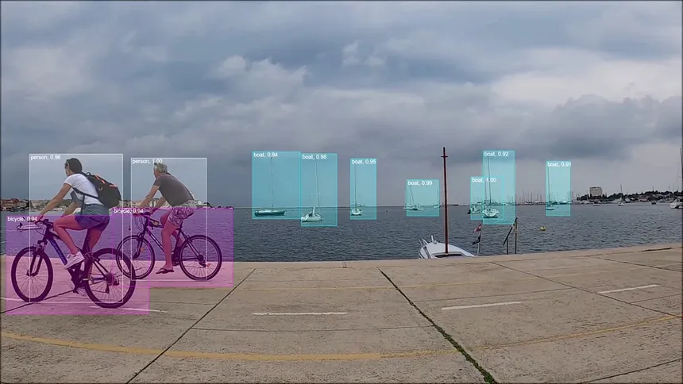  [Figure 4 - Exemple d'utilisation d'openCV](#list-of-figures) Source : viso.ai/ZGl1bV9WMl8xOTgw/JUUyJTgwJThBJ  Last search : 26/04/2024

### Uses cases 

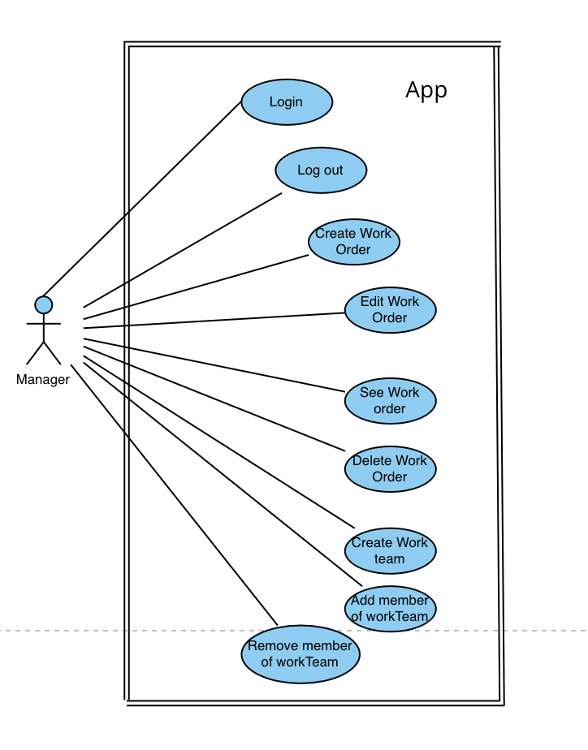

\newpage

### Description of uses cases

#### **Login:**

- **Primary Actor:** Technician
- **Objective:** To log in to access the features.
- **Preconditions:** The technician must be present on the site, connected to the Internet, and have an account.
- **Postconditions:** The technician is now logged into their account and can access the features.
- **Basic Flow:**
    1. The technician clicks on the login button.
    2. A login form appears.
    3. The technician enters the required information.
    4. The technician clicks on the login button.
    5. A success message appears.
    6. The technician is now logged in and can access the features.
- **Alternative Paths:**
    - If the provided login information is incorrect, an error message appears, prompting the technician to check their information and try again.

#### **Logout:**

- **Primary Actor:** Technician
- **Objective:** To log out.
- **Preconditions:** The technician must be present on the site and logged into the platform.
- **Postconditions:** The technician is logged out of their account.
- **Basic Flow:**
    1. The technician clicks on the logout button.
    2. A logout confirmation message appears.
    3. The technician confirms the logout.
    4. A success message appears.
    5. The technician is now logged out.
- **Alternative Paths:**
    - If the technician simply closes the browser without logging out, an inactive session may automatically end after a certain period of time, with prior notification.

#### **View Work Orders:**

- **Primary Actor:** Technician
- **Objective:** To view the list of work orders.
- **Preconditions:** The technician must be present on the site and logged into the platform.
- **Postconditions:** The technician views the available work orders.
- **Basic Flow:**
    1. The technician clicks on a link in the top menu of the site.
    2. The list of work orders appears.
    3. The technician can now view the list of work orders.
- **Alternative Paths:**
    - If no work orders are available, a message indicating the absence of work orders appears, prompting the technician to try again later or contact support.

#### **Select a Work Order:**

- **Primary Actor:** Technician
- **Objective:** To choose a work order.
- **Preconditions:** The technician must be present on the site, logged into the platform, and on the work orders list page.
- **Postconditions:** The technician has now selected the desired work order, and that order no longer appears in the list.
- **Basic Flow:**
    1. The technician clicks on the desired work order.
    2. A "Choose this work order" button appears.
    3. The technician clicks on the button.
    4. The work order is now associated with the technician who chose it.
- **Alternative Paths:**
    - If the selected work order is already assigned to another technician, a warning message appears indicating that the work order is unavailable.

#### **Validate a Work Order:**

- **Primary Actor:** Technician
- **Objective:** To validate a work order.
- **Preconditions:** The technician must be present on the site, logged into the platform, and have already selected a work order.
- **Postconditions:** The technician has validated the work order, and it no longer appears in their list.
- **Basic Flow:**
    1. The technician clicks on a link in the top menu of the site "View my work orders."
    2. The list of the technician's work orders appears.
    3. The technician clicks on the work order to be validated.
    4. A "Validate work order" button appears.
    5. The technician clicks on the button.
    6. A success message appears.

#### **Add Media to a Work Order:**

- **Primary Actor:** Technician
- **Objective:** To add media to a work order.
- **Preconditions:** The technician must be present on-site, logged into the platform, and have already selected a work order that is not yet validated.
- **Postconditions:** The technician has added media to a work order, and other individuals can view them.
- **Basic Flow:**
    1. The technician clicks on a link in the site's top menu labeled "View my work orders."
    2. The list of the technician's work orders is displayed.
    3. The technician selects the desired work order from the list.
    4. An "Add Media" button appears.
    5. The technician clicks on the button.
    6. A media addition form appears.
    7. The technician uploads the desired media.
    8. The technician submits the form.
    9. A success message is displayed.

- **Alternative Paths:**
    - If the uploaded media is incorrect, an error message is displayed.

### Test cases

| **Scenario** | Test Case Description | Preconditions | Test Steps | Expected Result |
|--------------|-----------------------|---------------|------------|-----------------|
| **Login** | Verify technician login | - Valid technician account credentials exist. - Technician is on the login page. | 1. Enter valid technician username and password. 2. Click on the login button. | Technician should be logged in successfully and directed to the dashboard. |
| **Logout** | Verify technician logout | - Technician is logged into the system. | 1. Click on the logout button. 2. Confirm the logout action. | Technician should be logged out successfully and redirected to the login page. |
| **View Work Orders** | Verify technician can view work orders | - Technician is logged into the system. | 1. Navigate to the "View Work Orders" section. | Technician should see a list of available work orders. |
| **Select a Work Order** | Verify technician can select a work order | - Technician is logged into the system and viewing the list of work orders. | 1. Click on a specific work order from the list. 2. Confirm the selection. | Selected work order should be associated with the technician. |
| **Validate a Work Order** | Verify technician can validate a work order | - Technician is logged into the system and has selected a work order. | 1. Navigate to the "View My Work Orders" section. 2. Click on the work order to be validated. 3. Confirm the validation action. | Selected work order should be validated and removed from the technician's list. |
| **Add Media to a Work Order** | Verify technician can add media to a work order | - Technician is logged into the system, has selected a work order, and the work order is not yet validated. | 1. Navigate to the selected work order. 2. Click on the "Add Media" button. 3. Upload the desired media. 4. Submit the form. | Media should be successfully added to the work order and visible to other users. |

### Mockups

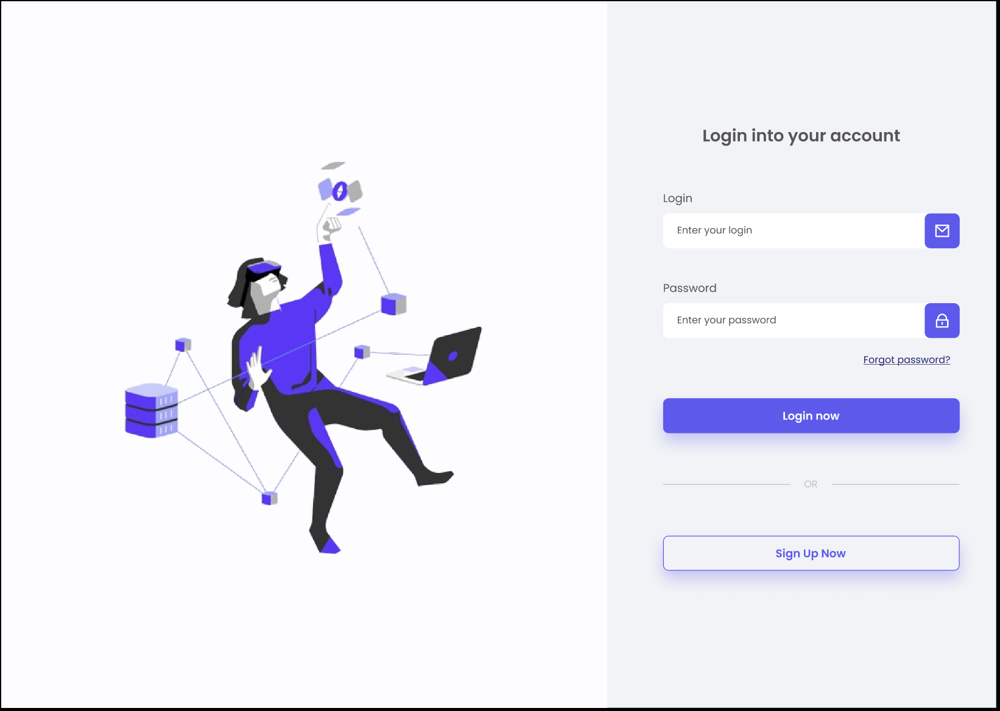

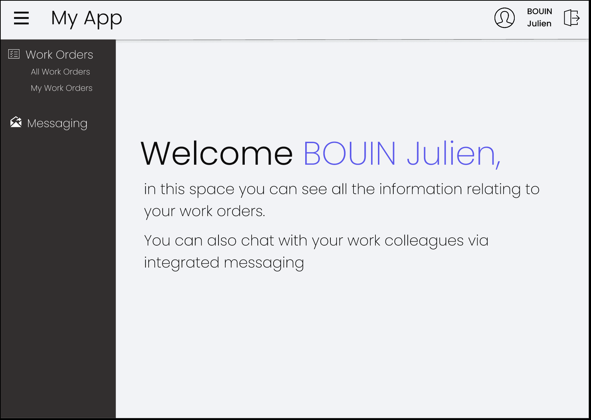
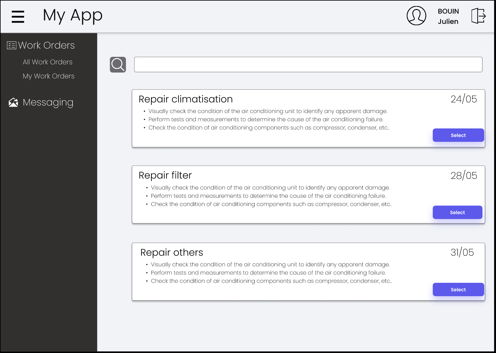
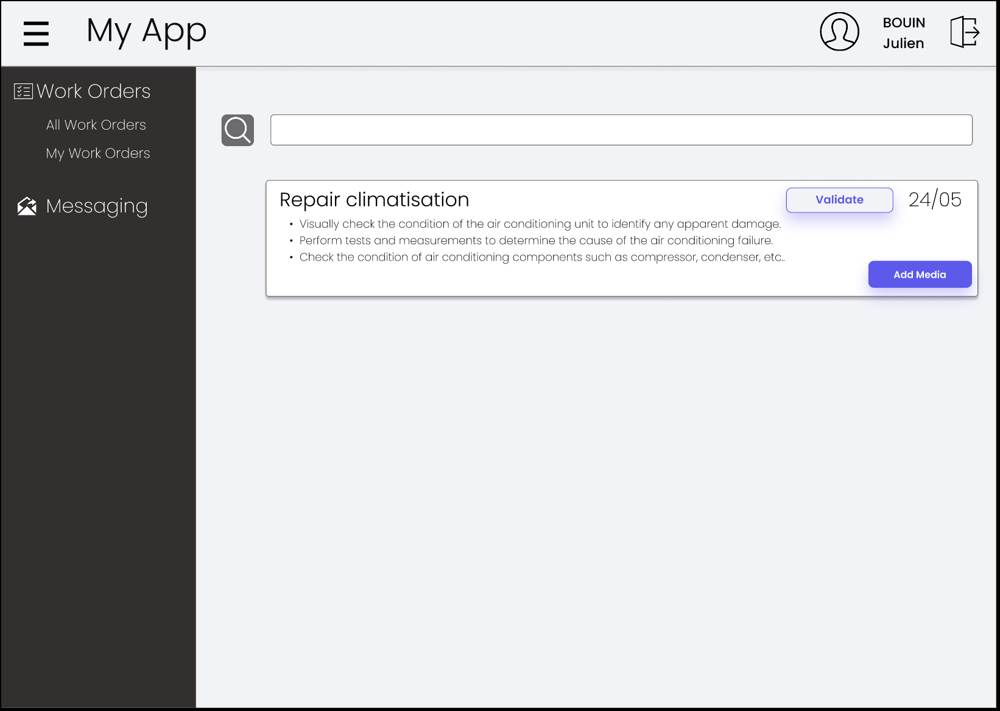
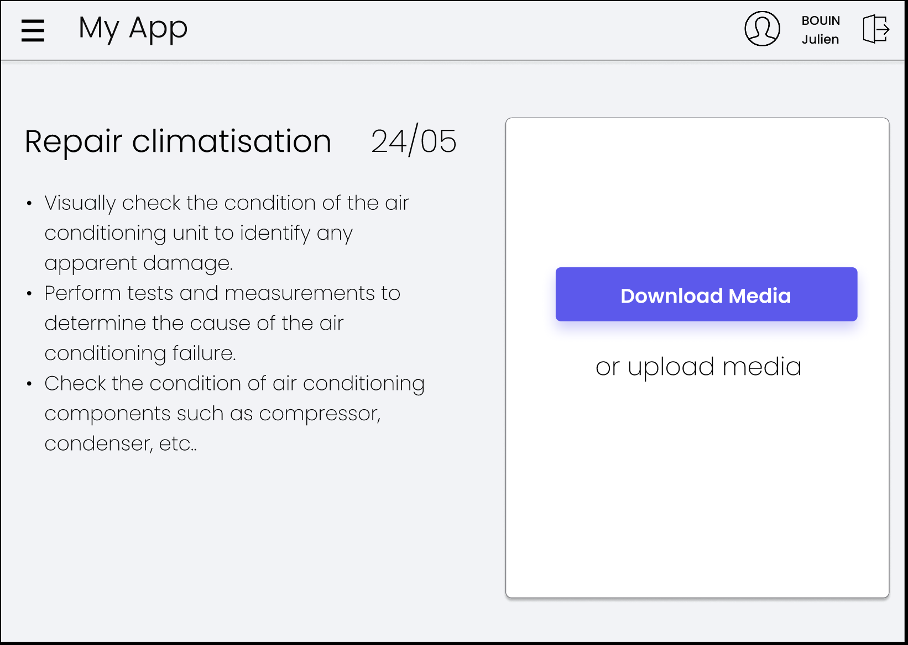

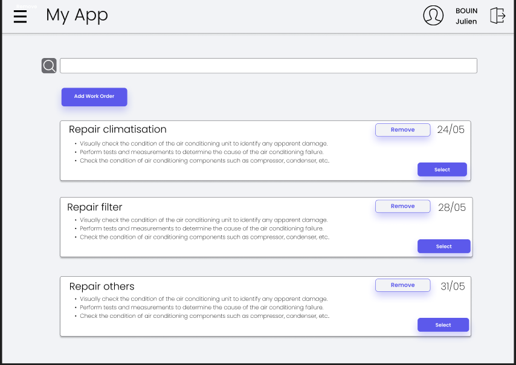
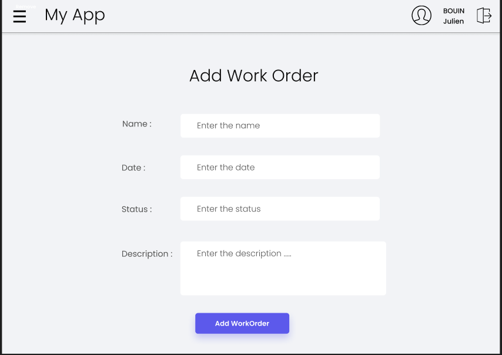

### Implementation

#### Part 1: Frontend Development Using Django Templates

During my internship, I was responsible for the frontend development of the application using Django templates. The goal was to create a user-friendly interface that is both functional and aesthetically pleasing. Here is a detailed account of the work I performed:

1. **Learning and Applying BEM for CSS**
   To ensure that the CSS was well-structured and maintainable, I learned and applied the BEM (Block, Element, Modifier) methodology. BEM is a naming convention for classes in HTML and CSS that helps in writing clean and manageable code. It divides the interface into independent blocks, with elements as child components and modifiers to signify variations. This approach made the CSS more readable and easier to debug.

2. **Building Responsive Layouts**
   One of the key requirements was to make sure that the application was responsive, meaning it should work seamlessly across different devices and screen sizes. I used a combination of CSS Grid and Flexbox to create fluid layouts. Media queries were implemented to adjust the design for mobile, tablet, and desktop views, ensuring a consistent user experience.

   - **CSS Grid**: This was used to create complex, multi-dimensional layouts. It allowed for the placement of elements into a grid-based structure, making it easier to manage different screen sizes.
   - **Flexbox**: This was used for simpler, one-dimensional layouts. It provided a flexible way to align and distribute space among items in a container, even when their size was unknown or dynamic.
   - **Media Queries**: These were used to apply different CSS rules based on the device's characteristics, such as screen width. This ensured that the layout adapted to various screen sizes, providing a good user experience on mobile phones, tablets, and desktop computers.

3. **Template Inheritance and Reusability**
   Django's template system allows for powerful features like template inheritance, which I leveraged to maintain a consistent layout across different pages. By creating a base template that included common elements such as the header, footer, and navigation menu, I was able to reuse these components in multiple pages, reducing redundancy and simplifying maintenance.

   - **Base Template**: This template included the HTML structure for the header, footer, and navigation menu. Other templates extended this base template, inheriting its structure and allowing for consistent design across the site.
   - **Block Tags**: These were used within the base template to define sections that child templates could override. This provided flexibility in customizing specific pages while maintaining a uniform overall structure.

4. **Integration with Backend Data**
   The frontend had to display dynamic data fetched from the backend. Using Django's templating language, I integrated data into the templates by passing context variables from views. This included displaying lists of work orders, user information, and other dynamic content.

   - **Context Variables**: These were passed from views to templates, allowing the templates to access and display dynamic data. For example, a list of work orders could be passed to a template and rendered in an HTML table.
   - **Template Tags and Filters**: These were used to manipulate and display data within the templates. Common tags included `` loops for iterating over data and `` statements for conditional rendering.

5. **User Interaction and Forms**
   To enhance user interaction, I implemented various forms using Django's form handling capabilities. This included login and registration forms, work order submission forms, and feedback forms. Client-side validation was added to improve user experience, ensuring immediate feedback on form inputs.

   - **Django Forms**: These were used to define the structure and validation rules for each form. By leveraging Django's built-in form classes, I was able to quickly create and validate forms.
   - **Client-side Validation**: This was implemented using JavaScript to provide instant feedback on form inputs. For example, if a required field was left empty, an error message would be displayed immediately without needing to reload the page.

  [Figure 6 - Login Page](#list-of-figures) 

### Part 2: API Development with Django REST Framework

The second part of my internship focused on creating a RESTful API using Django REST Framework (DRF). This API was designed to handle the data exchange between the frontend and backend, as well as facilitate integrations with other systems.

1. **Understanding REST and API Development**
   A RESTful API (Representational State Transfer) is an architectural style for designing networked applications. It relies on a stateless, client-server communication protocol, typically HTTP. RESTful APIs provide a way to interact with application data through standard HTTP methods such as GET, POST, PUT, and DELETE.

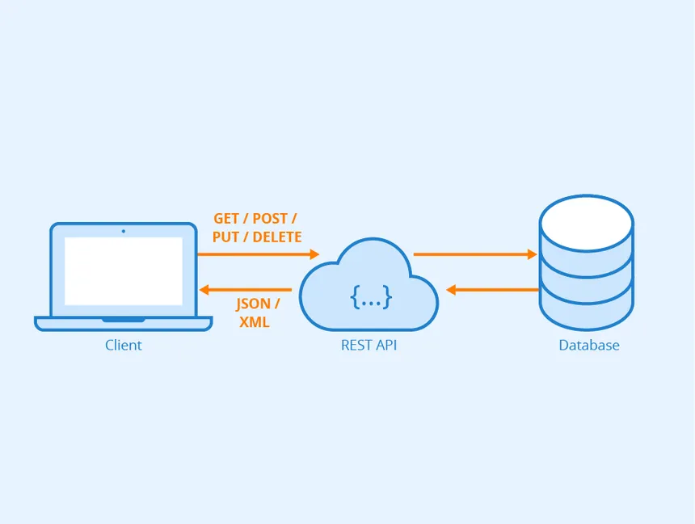  [Figure 5 - API REST using ](#list-of-figures) Source : https://www.astera.com/fr/type/blog/rest-api-definition/ Last search : 21/05/2024

2. **Setting Up Django REST Framework**
   Django REST Framework (DRF) is a powerful and flexible toolkit for building Web APIs. To set up DRF, I installed the necessary packages and configured Django settings to include `rest_framework`. This setup provided the tools needed to create API endpoints, handle authentication, and serialize data.

3. **Creating API Endpoints**
   I created various API endpoints to handle different aspects of the application, such as user authentication, work order management, and messaging. Each endpoint was defined in a dedicated view, using DRF's class-based views for better organization and scalability. These views were mapped to URL patterns in the `urls.py` file.

   - **Class-Based Views**: These were used to define the behavior of each endpoint. For example, `ListCreateAPIView` was used for endpoints that needed to handle both listing and creating resources.
   - **URL Routing**: URL patterns were defined to map each endpoint to its corresponding view. This allowed for clean and readable URLs.

4. **Serializing Data**
   Serialization is the process of converting complex data types, like Django models, into native Python data types that can be easily rendered into JSON or XML. I used DRF's serializers to convert model instances into JSON data and vice versa. This was crucial for data exchange between the frontend and the backend.

   - **ModelSerializers**: These were used to automatically generate serializers based on Django models. This simplified the process of converting model instances to JSON and back.
   - **Custom Serializers**: In some cases, custom serializers were created to handle more complex data transformations or validations.

5. **Implementing Token-Based Authentication**
   For secure API access, I implemented token-based authentication using DRF's built-in token authentication system. Each user was issued a unique token upon successful login, which had to be included in the headers of subsequent API requests. This ensured that only authenticated users could access protected endpoints.

   - **Token Generation**: Tokens were generated upon successful login and returned to the client. These tokens were stored client-side and included in the headers of API requests.
   - **Token Validation**: On the server side, each request included a token in the header. The token was validated before processing the request to ensure the user was authenticated.

\newpage

### Development of a mmobile application

## Why a mobile application ?

After developing a website to meet the needs I mentioned earlier, my supervisor suggested creating a mobile application that replicates the website's functionalities, allowing technicians to access it directly via their phones. Technicians will be able to log in, view their work orders, select them, and add notes, just like on the website. However, the main advantage of this application is that it allows technicians to continue updating their work orders even without a connection. They will be able to add notes, move work orders to different states, and when the connection is restored, all changes will be synchronized with our application.

## Choice of Language

Initially, upon learning that I needed to develop a mobile application, I realized that I didn't know much about mobile applications. Therefore, I conducted extensive research.
Two technologies stood out: React Native and Flutter.

  [Figure 6 - Flutter vs React ](#list-of-figures) Source : https://imgs.search.brave.com/NFHNKJc Last search : 28/05/2024

React Native is an open-source mobile application development framework created by Facebook, while Flutter is another open-source mobile application development framework, created by Google.
These two technologies caught my eye because they both allow the development of applications for both Android and iOS devices.
Thus, I conducted further research to determine which one would be more advantageous in my case.

| **React Native**                                                                    | **Flutter**                                                                             |
|-------------------------------------------------------------------------------------|-----------------------------------------------------------------------------------------|
| **Advantages:** Utilizes JavaScript and React, familiar to web developers.          | **Disadvantages:** Dart may require additional learning for some developers.             |
| **Advantages:** Employs native components, delivering near-native performance.      | **Advantages:** Often boasts superior performance due to its efficient rendering engine.  |
| **Disadvantages:** May necessitate bridges for accessing specific native components.| **Advantages:** Provides a plethora of customizable, integrated widgets.                |
| **Advantages:** Facilitates instant viewing of changes without recompilation.       | **Advantages:** Offers hot reload functionality for rapid testing and development.        |
| **Advantages:** Boasts a large community and a rich ecosystem of tools and libraries| **Disadvantages:** Community size is smaller but rapidly expanding.                        |
| **Advantages:** Offers a broad selection of available libraries.                    | **Disadvantages:** Presents fewer third-party libraries, albeit under development.         |
| **Advantages:** Easy for JavaScript and React proficient individuals to learn.      | **Disadvantages:** Dart may pose a learning curve for some developers.                    |
| **Advantages:** Provides extensive documentation and abundant online resources.     | **Advantages:** Furnishes clear, well-organized documentation courtesy of Google.          |
| **Advantages:** Benefits from consistent support and updates from Facebook.         | **Advantages:** Actively maintained by Google, ensuring regular updates.                  |
| **Disadvantages:** Integrating with native modules may require additional effort.   | **Advantages:** Offers seamless integration with native platforms via diverse widgets.     |

After this research, I realized that React Native suited my needs better, and the fact that it uses JavaScript was a big plus for me since I am very comfortable with this language.
Therefore, I chose React Native.

\newpage

# References

::: {#refs}
:::
