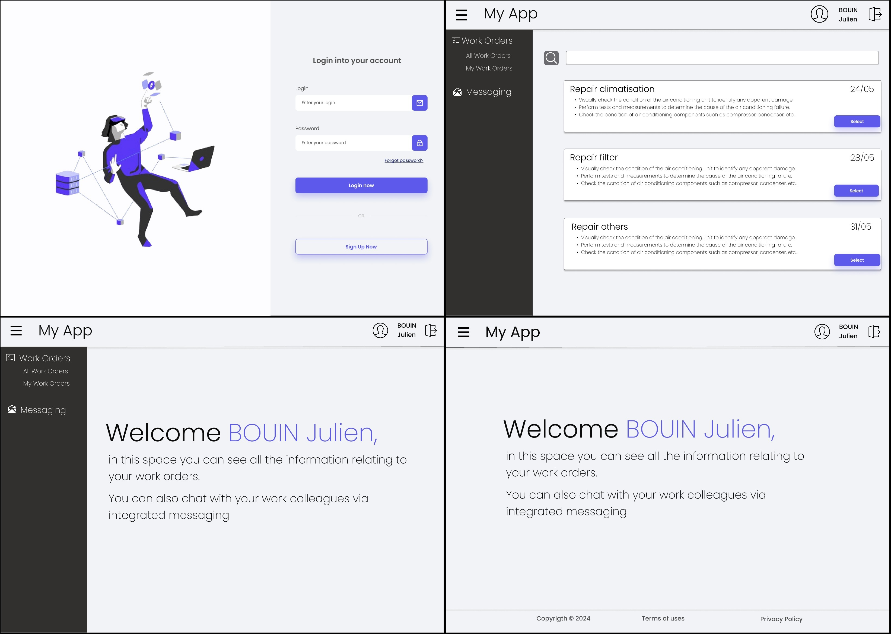
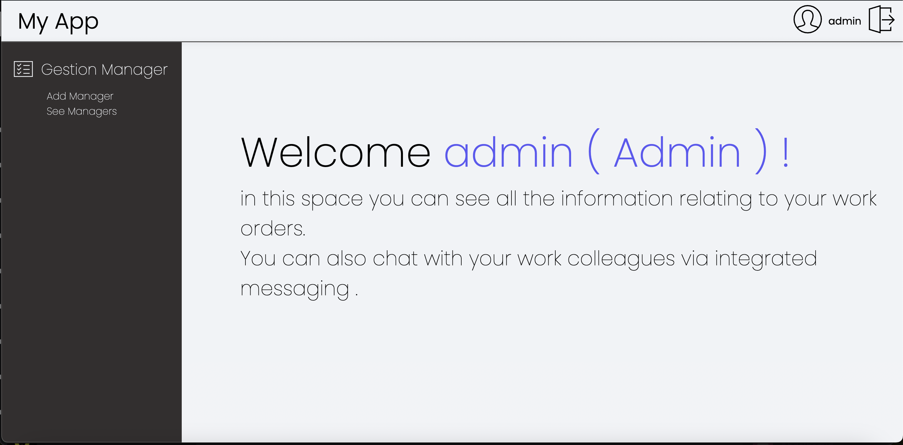
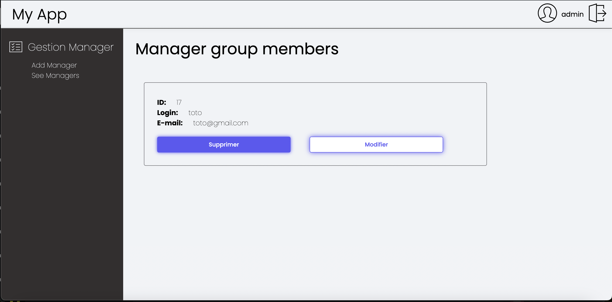
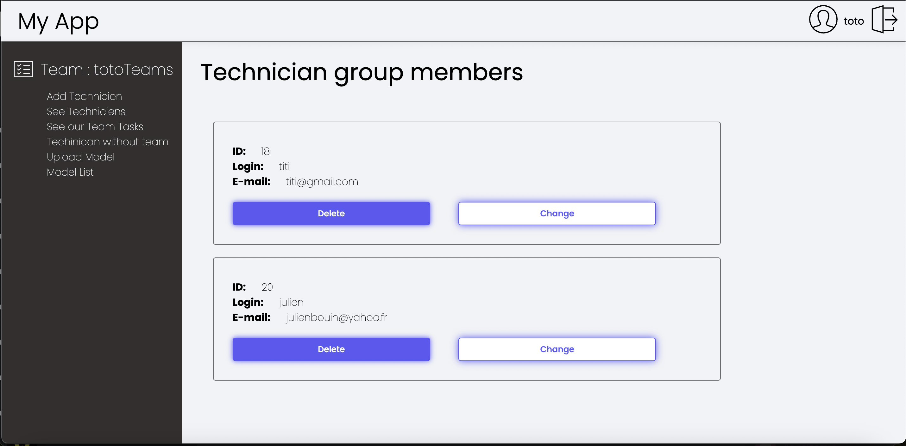
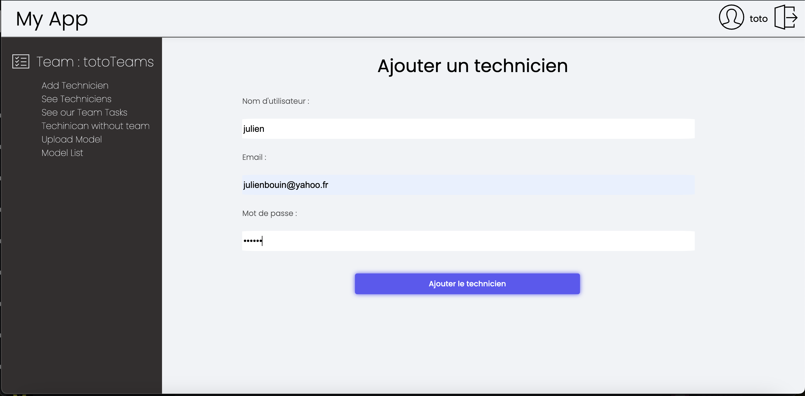

\break

\newpage

# 
## Abstract

The completion of a three-month internship at the Instituto Superior de Engenharia de Coimbra (ISEC) in Portugal, as part of the Erasmus program, has been a rewarding and formative experience for me. Collaborating with my colleague Rayane Belguebli and under the guidance of our supervisor, Mateus Mendes, our mission was to develop a full-stack website with tight integration between the backend and frontend. This project, based on Django, aims to connect a Computerized Maintenance Management System (CMMS) to an Augmented Reality (AR) interface, thereby facilitating maintenance operations management. My primary role was focused on frontend development of the application.

Additionally, I also contributed to the development of mobile applications enabling maintenance technicians to update their interventions directly from their phones, even in the absence of Wi-Fi connectivity.

This internship represents a unique opportunity to explore the synergies between CMMS and AR technologies while deepening my understanding of frontend development. By concentrating my efforts on the frontend, I aimed to bridge the gap between backend infrastructure and user interfaces. Contributing to a tangible project, as described in the referenced article, has bolstered my motivation by emphasizing the relevance and significance of our work.

\newpage

## List of Figures

1. [Figure 1: Explanation of the MVT Architecture](#one)
2. [Figure 2: Explanation of CMMS](#explication-de-cmms)
3. [Figure 3: Illustration of Augmented Reality](#illustration-de-la-réalité-augmentée)

4. [Figure 4 : Example of OpenCv use](#example-opencv)

\newpage

## List of Acronyms
- **AR**: Augmented Reality
- **ORM**: Object-Relational Mapping
- **MVT**: Model-View-Template
- **CMMS**: Computerized Maintenance Management Systems
- **API**: Application Programming Interface

\newpage

# Introduction
At the end of my two years at IUT A of the University of Lille, I undertook a three-month internship to validate my diploma. I chose to do this internship abroad through the Erasmus program, which led me to Instituto Superior de Engenharia de Coimbra (ISEC) in Portugal. I completed this project with my colleague Rayane Belguebli, and we were supervised by our tutor, Mateus Mendes.

We were tasked with developing a full-stack website requiring close integration between the backend and frontend. Our application, developed with Django, will be connected to a Computer-Aided Maintenance Management System (CMMS) to effectively manage maintenance operations. The frontend, also built with Django, will serve augmented reality (AR), an immersive technology that enhances user experience by providing contextual information in real time. Our project is directly related to the work presented in the article **[@ana2021augmented]  [[1]](#references)**. Our goal is to connect the CMMS to AR, so that technicians can directly see what they need to do on our site and then visualize it through AR; therefore, we will be responsible for the server and the database. My role primarily focuses on frontend development.

Additionally, I also worked on the development of mobile applications allowing maintenance technicians to update their interventions directly from their phones, even without Wi-Fi connection.

This internship offers a unique opportunity to explore the synergies between CMMS and AR technologies, and to deepen my understanding of frontend development. By primarily focusing on frontend development, this internship aims to bridge the gap between backend infrastructure and user interfaces. Furthermore, contributing to a project with real-world applications, as demonstrated in **[@ana2021augmented]  [[1]](#references)**, is a great source of motivation, highlighting the relevance and importance of our work.

\newpage

# 

## What is Django?

Django is an open-source web framework written in Python, designed to simplify the development of complex and scalable web applications. Launched in 2005, Django is maintained by an active community of developers and is widely used in the industry to create a variety of web applications, ranging from simple websites to complex web platforms.

**Key features of Django:**

- **Full-stack Web Framework**: Django is a full-stack web framework, providing all the necessary tools to develop both the frontend and backend of a web application, including database management, business logic, URL routing, and form handling .
- **MVT Architecture (Model-View-Template)**: Unlike the MVC model, Django follows the MVT architecture where models represent application data, templates are responsible for presentation, and views contain the processing logic . 

 [Figure 1 - Explanation MVT](#list-of-figures)

- **ORM (Object-Relational Mapping)**: An ORM is a programming technique that allows mapping objects from an object-oriented programming language (such as Python, Java, etc.) to data stored in a relational database . Rather than writing SQL queries directly, the ORM allows developers to interact with the database using familiar objects and methods, thus facilitating application development and maintenance. In summary, an ORM abstracts the complexity of the relational database, allowing developers to work with data in a more object-oriented way.
- **URL Routing System**: Django uses a URL routing system that maps URLs to corresponding views, providing clean and efficient route management in the application .

- **Built-in Security**: Django comes with many built-in security features, such as protection against common security vulnerabilities like SQL injection attacks, cross-site scripting (XSS) attacks, and bypassing form validation.

- **Automatic Administration**: Django provides an automatically generated admin interface from the data models, allowing administrators to manage site content without needing to write specific code for it .

- **Batteries Included**: Django follows the "batteries included" principle, meaning it provides many ready-to-use features like user authentication, session management, pagination, static file management, and more .

- **Extensibility**: Django is highly extensible, allowing developers to add custom features to their application by using third-party packages or writing their own custom code .

## What is CMMS (Computerized Maintenance Management Systems)?
Computerized maintenance management systems (CMMS) are sophisticated software solutions deployed by organizations to effectively streamline their maintenance operations. These systems form the backbone of maintenance management, orchestrating various tasks such as planning, organizing, tracking and managing maintenance activities across the organization.

At the heart of a CMMS is a robust and comprehensive database, which acts as a centralized repository of vital information relating to the organization's maintenance operations. This database stores a wealth of data, including detailed equipment specifications, maintenance schedules, historical maintenance records, spare parts inventory and work order histories.

One of the key benefits of CMMS is its ability to empower maintenance technicians by providing them with instant access to relevant information needed to perform their tasks accurately. Using the CMMS interface, technicians can quickly identify equipment requiring maintenance, view detailed maintenance procedures, and determine the availability of required spare parts. This streamlined access to information not only improves the efficiency of maintenance activities, but also helps minimize downtime by ensuring timely maintenance interventions.

In addition, CMMS plays a crucial role in facilitating informed decision-making at the managerial level. By analyzing the data stored in the CMMS database, managers can gain valuable insights into the performance of their maintenance operations. They can track key performance indicators, identify trends and forecast maintenance needs, enabling them to make data-driven decisions regarding resource allocation, budgeting and strategic planning. For example, managers can calculate the financial implications of repairing machine breakdowns versus preventative maintenance measures, thereby optimizing maintenance budgets and improving operational efficiency.

In summary, CMMS is a powerful tool for effectively managing a company's maintenance resources. By centralizing maintenance-related information, streamlining processes and providing valuable insights, CMMS enables organizations to optimize their maintenance operations, minimize downtime, reduce maintenance costs and, in turn, ultimately drive overall organizational performance and market competitiveness. But although it is very effective and useful for businesses it nevertheless remains very complex, as this article explains **[@mather2002cmms] [[2]](#references)**

  [Figure 2 - Explanation CMMS](#list-of-figures) Source : limblecmms.com/ZGl1bV9WMl8xOTgw/JUUyJTgwJThBJ  Last search : 24/04/2024

## What is Augmented Reality?

Augmented Reality (AR) is a revolutionary technology that overlays virtual elements such as images, videos, or 3D models onto the real world, typically through an electronic device such as a smartphone, tablet, or smart glasses. Unlike Virtual Reality (VR), which creates an entirely virtual environment, AR enhances and improves the real environment by adding digital information in real time.

Augmented reality applications can take various forms, offering a wide range of uses. They can serve as product visualization tools, allowing consumers to virtually try out products before purchasing them. Additionally, they can be used in interactive games that blend the real world and the virtual world, providing immersive and innovative gaming experiences. In the field of education, augmented reality can be used as an interactive learning tool, allowing learners to explore subjects in a more engaging and practical manner. Similarly, in the field of assistance, it can provide step-by-step guides to help users perform complex tasks, such as repairing electronic devices or navigating unfamiliar environments.

In summary, augmented reality offers significant potential to transform our interaction with the world around us, providing rich and immersive experiences in many areas, ranging from entertainment to education to commerce and industry.

  [Figure 3 - AR Illustration](#list-of-figures) Source : gettyimages.fi/ZGl1bV9WMl8xOTgw/JUUyJTgwJThBJ  Last search : 24/04/2024

## Integration of Augmented Reality into Maintenance

The integration of Augmented Reality (AR) into maintenance operations signifies a remarkable advancement in optimizing industrial processes. By harmonizing the sophisticated functionalities of Computerized Maintenance Management Systems (CMMS) with the immersive capabilities of augmented reality, companies can curtail unplanned downtime and enhance overall operational efficiency. Through AR, maintenance technicians gain access to real-time contextual information seamlessly integrated into their field of vision, empowering them to conduct inspections and repairs with unprecedented precision. For instance, utilizing augmented reality glasses or headsets, a technician can effortlessly visualize critical data such as electrical schematics, technical specifications, or repair instructions overlaid onto the actual equipment, thereby diminishing the reliance on traditional paper manuals or digital documents on laptops and enabling faster and more precise interventions. Additionally, AR facilitates interactive step-by-step guides for intricate maintenance procedures, mitigating the risk of human errors and elevating the quality of repairs. By seamlessly integrating augmented reality into the existing framework of maintenance management systems, companies not only modernize their maintenance processes but also ignite innovation and fortify their competitive stance in the market.

A tangible application of AR in maintenance is illustrated in the article by **[@henderson2010exploring] [[3]](#references)**. They devised a prototype aimed at assisting military mechanics in executing routine maintenance tasks within an armored vehicle turret. The prototype employs a head-mounted display to augment a mechanic's natural view with text, labels, arrows, and animated sequences, tailored to enhance comprehension, localization, and task execution. A qualitative survey conducted revealed that mechanics found the augmented reality conditions intuitive and satisfactory for the tested task sequence.

Expanding on this momentum, a recent empirical study by **[@fiorentino2014augmented] [[4]](#references)** was conducted to assess the efficacy of technical maintenance aided by interactive instructions in augmented reality. This study introduces an innovative methodology incorporating augmented visualization on a large screen in conjunction with a fusion of multiple fixed and mobile cameras, leveraging commercially available solutions. During the experiment, 14 participants undertook a series of four maintenance tasks centered on manual inspections of a motorcycle engine. With augmented instructions providing support through visual labels, 3D virtual models, and animations, participants executed tasks such as tool selection, bolt removal, and part disassembly. Comparisons were drawn between traditional paper textbooks and augmented instructions. Results of rigorous statistical analyses unequivocally demonstrated that augmented instructions significantly reduced overall execution time and participant error rates, thereby underscoring the transformative potential of AR in optimizing maintenance processes.

To be even more concrete, we're going to look at a method of implementing augmented reality using Python . We're going to take a look at an Open CV Python library. This library was originally developed by Intel, which specializes in real-time image processing. The robotics company Willow Garage, followed by ItSeez, have since supported this library.
The library provides a wide range of functions for creating programs from raw data to basic graphical interfaces. The software can also be used to develop facial recognition methods.

  [Figure 4 - Exemple d'utilisation d'openCV](#list-of-figures) Source : viso.ai/ZGl1bV9WMl8xOTgw/JUUyJTgwJThBJ  Last search : 26/04/2024

# Web Application

This chapter delves into the detailed process of developing our web application, from defining the requirements to practical implementation. It highlights the key stages of development, including requirement analysis, user interface design, and feature implementation.

## Requirement Definition with Use Cases

The first step in development involved defining the functional requirements of the system using use cases. These allowed us to model the interactions between users and the system, identifying the main features and associated workflows.

### Use Cases

### Description of Use Cases

**Login:**

- **Actor:** Technician
- **Objective:** Log in to access features.
- **Preconditions:** On-site, connected to the Internet, and have an account.
- **Postconditions:** Logged in and can access features.
- **Steps:**
    1. Click on login.
    2. Enter required information.
    3. Click login.
    4. See success message.
    5. Logged in.

**Logout:**

- **Actor:** Technician
- **Objective:** Log out.
- **Preconditions:** On-site and logged in.
- **Postconditions:** Logged out.
- **Steps:**
    1. Click logout.
    2. Confirm logout.
    3. See success message.
    4. Logged out.

**View Work Orders:**

- **Actor:** Technician
- **Objective:** View work orders.
- **Preconditions:** On-site and logged in.
- **Postconditions:** View available work orders.
- **Steps:**
    1. Click work orders link.
    2. See list of work orders.
    3. View work orders.

**Select Work Order:**

- **Actor:** Technician
- **Objective:** Choose a work order.
- **Preconditions:** On-site, logged in, and on work orders list page.
- **Postconditions:** Selected work order, removed from list.
- **Steps:**
    1. Click desired work order.
    2. Click "Choose this work order".
    3. Work order associated.

**Validate Work Order:**

- **Actor:** Technician
- **Objective:** Validate a work order.
- **Preconditions:** On-site, logged in, and selected a work order.
- **Postconditions:** Validated work order, no longer in list.
- **Steps:**
    1. Click "View my work orders".
    2. See list of work orders.
    3. Click work order to validate.
    4. Click "Validate work order".
    5. See success message.

**Add Media to Work Order:**

- **Actor:** Technician
- **Objective:** Add media to a work order.
- **Preconditions:** On-site, logged in, and selected a work order not yet validated.
- **Postconditions:** Media added to work order, viewable by others.
- **Steps:**
    1. Click "View my work orders".
    2. See list of work orders.
    3. Select work order.
    4. Click "Add Media".
    5. Upload media.
    6. Submit.
    7. See success message.

**Alternative Paths:** Display error message if uploaded media is incorrect.

## User Interface Design with Mockups

Next, I created mockups to visually represent the user interface. These mockups were invaluable in clarifying design expectations and facilitating faster, more organized graphical interface development.

## Implementation

### Frontend Development Using Django Templates

Lorsque j'ai commencé à travailler sur l'application, je savais que la présentation et l'organisation du code CSS seraient cruciales pour maintenir un design propre et évolutif. J'ai donc appris et appliqué la méthodologie BEM (Block, Element, Modifier). Cette convention de nommage pour les classes HTML et CSS permet de diviser l'interface en blocs indépendants, avec des éléments comme composants enfants et des modificateurs pour indiquer les variations. Cela a rendu le CSS plus lisible et plus facile à déboguer.

Mon premier défi fut de créer une page de connexion simple mais efficace. J'ai utilisé les templates Django pour structurer la page, en m'assurant que les champs de formulaire étaient correctement connectés aux vues backend. En utilisant BEM, j'ai nommé les classes de manière claire, ce qui a facilité la gestion du CSS.

Un des principaux objectifs était de rendre l'application responsive, c'est-à-dire qu'elle devait fonctionner de manière fluide sur divers appareils et tailles d'écran. Pour cela, j'ai utilisé une combinaison de CSS Grid et Flexbox pour créer des mises en page fluides. Les media queries ont été essentielles pour ajuster le design aux vues mobiles, tablettes et ordinateurs, assurant ainsi une expérience utilisateur cohérente.

 [Figure 6 - Login Page](#list-of-figures)

Ensuite, je suis passé à la création de la page principale de l'application. J'ai exploité le système de template de Django pour garantir une mise en page cohérente sur différentes pages grâce à l'héritage de templates. En créant un template de base contenant des éléments communs comme l'en-tête, le pied de page et le menu de navigation, j'ai pu réutiliser ces composants sur plusieurs pages, réduisant ainsi la redondance et simplifiant la maintenance.

 [Figure 7 - Main Page](#list-of-figures)

La prochaine étape était de faire en sorte que le frontend affiche des données dynamiques récupérées depuis le backend. En utilisant le langage de template de Django, j'ai intégré les données dans les templates en passant des variables de contexte depuis les vues. Cela incluait l'affichage de listes de commandes de travail, d'informations utilisateur et d'autres contenus dynamiques. Les balises de template et les filtres de Django m'ont permis de manipuler et d'afficher les données dans les templates.

 [Figure 7 - List of Managers](#list-of-figures)

 [Figure 8 - List of Technician ](#list-of-figures)

Pour améliorer l'interaction utilisateur, j'ai implémenté divers formulaires en utilisant les capacités de gestion des formulaires de Django. Cela comprenait les formulaires de connexion et d'inscription, les formulaires de soumission de commandes de travail et les formulaires de feedback. J'ai ajouté une validation côté client pour améliorer l'expérience utilisateur, en fournissant des retours immédiats sur les entrées des formulaires.

 [Figure 9 - Example of form ](#list-of-figures)

Après avoir mis en place la base du frontend, j'ai commencé à travailler sur le backend. Grâce aux outils et fonctionnalités de Django, j'ai pu rapidement mettre en place des vues, des modèles et des formulaires pour gérer les données et la logique de l'application.

Cette aventure dans le développement frontend avec Django m'a permis de comprendre l'importance de la structuration et de la réactivité dans le design web. Grâce à l'utilisation de méthodologies comme BEM et aux puissantes fonctionnalités des templates Django, j'ai pu créer une application à la fois belle et fonctionnelle .

### API Development with Django REST Framework

The second part of my internship focused on creating a RESTful API using Django REST Framework (DRF). This API aimed to manage data exchanges between the frontend and backend, as well as facilitate integrations with other systems. This step was crucial for the continuation of my work.

Firstly, it was crucial to understand what a REST API is and how to develop one. A RESTful API (Representational State Transfer) is an architectural style for designing networked applications. It relies on a stateless client-server communication protocol, typically HTTP. RESTful APIs allow interacting with application data via standard HTTP methods such as GET, POST, PUT, and DELETE.

 [Figure 5 - API REST using](#list-of-figures) Source: [https://www.astera.com/fr/type/blog/rest-api-definition/](https://www.astera.com/fr/type/blog/rest-api-definition/) Last search: 21/05/2024

To set up this REST API using Django, I chose to use a Django framework called Django REST Framework, which allows for quicker and easier creation of REST APIs. I downloaded this framework.

Next, I created several API endpoints to handle different aspects of the application, such as user authentication and work order management. Each endpoint was defined in a dedicated view, using DRF's class-based views for better organization and scalability. These views were then associated with URL patterns in our Django app's urls.py file.

For data serialization, I used DRF serializers to convert model instances into JSON data and vice versa. This was crucial for data exchange between the frontend and backend. ModelSerializers simplified the conversion of model instances into JSON, and in some cases, custom serializers were created to handle more complex data transformations or validations.

Finally, to secure access to the API, I implemented token-based authentication using DRF's built-in token authentication system. Several token systems are available via DRF, but I decided to use Token BASIC as it was the most suitable in this situation. Each user received a unique token after successful login, which had to be included in the headers of subsequent API requests. This ensured that only authenticated users could access protected endpoints.

In summary, this part of my internship allowed me to develop a comprehensive RESTful API via Django, from the initial configuration of DRF to the creation of secure endpoints and data serialization management. This strengthened my backend development skills using Django.

### Test Cases

After finishing the development of our website, we performed test cases to summarize what we have done and what is possible to do in our application. Here, we focused only on the use cases that directly change the data of our website.

#### Test Scenarios - Function: `take_task`

##### Scenario 1: Successful Task Takeover
**Description:** Verify that a technician can successfully take a task with valid details.
**Expected Result:** The task is updated, added to the technician's list, and a success message is displayed.
**Actual Result:** The task is updated, added to the technician's list, and a success message is displayed.
**Status:** Passed

##### Scenario 2: Task Takeover with Non-existent User
**Description:** Verify that an error is handled when the user ID does not exist.
**Expected Result:** An error message "The user or task does not exist." is displayed.
**Actual Result:** An error message "The user or task does not exist." is displayed.
**Status:** Passed

##### Scenario 3: Task Takeover with Non-existent Task
**Description:** Verify that an error is handled when the task ID does not exist.
**Expected Result:** An error message "The user or task does not exist." is displayed.
**Actual Result:** An error message "The user or task does not exist." is displayed.
**Status:** Passed

##### Scenario 4: GET Request to Take Task Endpoint
**Description:** Verify that the take task endpoint does not allow GET requests.
**Expected Result:** The request is ignored or an appropriate response is given.
**Actual Result:** The request is ignored or an appropriate response is given.
**Status:** Passed

##### Scenario 5: Authorization Check
**Description:** Verify that only users with technician rights can access the take task functionality.
**Expected Result:** Access is denied, and the user is redirected or shown an error message.
**Actual Result:** Access is denied, and the user is redirected or shown an error message.
**Status:** Passed

##### Scenario 6: Odoo Integration Error Handling
**Description:** Verify that an error message is shown if there is an issue with Odoo integration.
**Expected Result:** An error message detailing the Odoo error is displayed.
**Actual Result:** An error message detailing the

\newpage

# Mobile Application
## Development of a mobile application

### Why a mobile application?

Following the development of a website to address the aforementioned needs, my supervisor proposed creating a mobile application mirroring the website's functionalities. This would enable technicians to directly access it via their phones. Technicians can log in, view their work orders, select them, and add notes similar to the website. However, the significant advantage of this application is its offline functionality. Technicians can update their work orders even without an internet connection. They can add notes, change work order states, and upon reconnecting, all changes will synchronize with our application.

### Choice of Language

Initially, with little knowledge about mobile applications, I conducted thorough research upon realizing the need to develop one. Two standout technologies emerged: React Native and Flutter.

React Native, an open-source framework by Facebook, and Flutter, by Google, support cross-platform development for both Android and iOS. Further research was conducted to determine the most suitable choice.

After evaluation, React Native emerged as the preferred option. Its utilization of JavaScript, a familiar language, was advantageous for me. 

### Use Cases

For this application, the use cases remained consistent with our web application. The primary goal was to provide technicians with identical functionalities on their mobile devices as on the website.

### Development with React Native

The development of the mobile application was an enriching journey, where I delved into React Native's intricacies while addressing project-specific challenges. Here's an account of my experiences throughout the development process:

#### Project Structuring

Initiating the mobile application development, my first step was meticulously organizing the project structure. Drawing inspiration from React Native community best practices, I divided the code into distinct components, views, and functionalities. This structuring facilitated clear project oversight and seamless navigation between code segments.

#### Creation of Reusable Components

Subsequently, emphasis was placed on crafting reusable components. Recognizing code reusability's pivotal role in maintaining clean and efficient code, I developed components for common UI elements like buttons, forms, and lists. This approach optimized time and effort by averting code duplication.

#### State Management

Effectively managing the application state emerged as a crucial lesson during development. Leveraging React's state hooks and contexts, I ensured consistent data sharing among various components. This fostered a smooth and responsive user experience, even during concurrent interactions with multiple components.

#### Smooth Navigation

Establishing seamless navigation between application screens posed an exciting challenge. Utilizing Expo Router, I structured a clear navigation hierarchy and defined fluid transitions between different views. This library provided the requisite flexibility to design an intuitive and ergonomic user experience.

#### Offline Capability

One of the application's most intriguing features was its offline functionality. I designed the application to locally store necessary data and synchronize modifications with the backend upon internet reconnection. This feature proved invaluable in scenarios with limited or unstable internet connectivity, crucial for technicians to modify work orders during maintenance operations.

#### Seamless API Integration

A gratifying aspect of my work was ensuring seamless integration between the mobile application and the existing backend. By utilizing the same API endpoints as the web application, I ensured a consistent user experience. Technicians could access the same data and functionalities across both web and mobile platforms. This compatibility bolstered our commitment to delivering a uniform and fluid user experience across devices.

# Conclusion

My internship experience at the Instituto Superior de Engenharia de Coimbra (ISEC) has been a period filled with discoveries and learning. By working on the development of a full-stack website and mobile applications integrating CMMS and augmented reality technologies, I have deepened my skills in both frontend and backend development.

Collaborating with my colleague Rayane Belguebli and our supervisor, Mateus Mendes, was essential for the success of this project. Together, we overcame technical challenges and made progress towards achieving our goals.

This internship has also provided me with a better understanding of the importance of synergies between different technologies and their impact on the efficiency of maintenance processes. The integration between CMMS and augmented reality offers promising prospects for the future of maintenance operations management.

In conclusion, this experience has not only allowed me to acquire new technical skills but has also provided me with a deeper insight into the challenges and opportunities in the field of software development applied to industrial maintenance. I am grateful for this opportunity and confident that the knowledge gained during this internship will be valuable for my future professional journey.

\newpage

# References

::: {#refs}
:::
