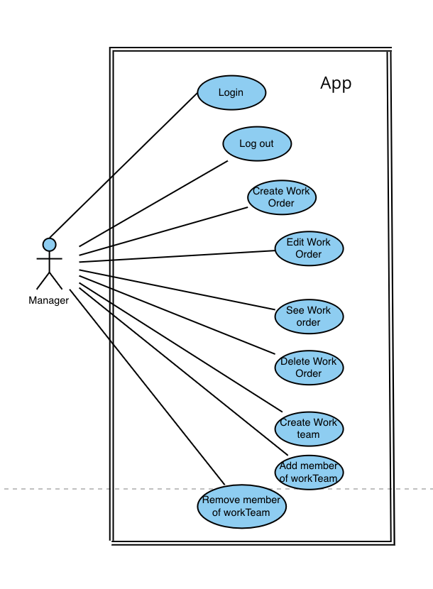
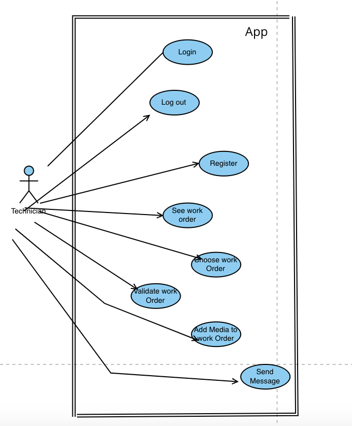

\break

\newpage

## Abstract
Content of the abstract.

\newpage

## Table of contents

[Abstract](#abstract)................................ i

[Table of content](#table-of-contents)....................................... 1

[List of Tables](#list-of-tables).................... 2

[List of Figures](#list-of-figures).................. 3

[List of Abbreviations](#list-of-abbreviations)...... 4

[List of Acronyms](#list-of-acronyms)................ 5

[List of Symbols](#list-of-symbols).................. 6

[Introduction - First Chapter](#introduction)......................... 7

[Second Chapter](#chapter-2)...... 8

[Bibliographic References](#references)....... 11

\newpage

## List of Tables
Content of the list of tables.

\newpage

## List of Figures

1. [Figure 1: Explanation of the MVT Architecture](#one)
2. [Figure 2: Explanation of CMMS](#explication-de-cmms)
3. [Figure 3: Illustration of Augmented Reality](#illustration-de-la-réalité-augmentée)

4. [Figure 4 : Example of OpenCv use](#example-opencv)

\newpage

## List of Abbreviations
- **CMMS**: Computerized Maintenance Management Systems

\newpage

## List of Acronyms
- **AR**: Augmented Reality
- **ORM**: Object-Relational Mapping
- **MVT**: Model-View-Template

\newpage

## List of Symbols
Content of the list of symbols.

\newpage

# Introduction
We are faced with the development of a full-stack website that requires tight integration between the backend and the frontend. The backend and frontend of our application will be developed using Django. It will be interconnected to a Computerized Maintenance Management System (CMMS) for effective management of maintenance operations. On the other hand, the frontend, also built with Django, will be linked to augmented reality (AR), an immersive technology that enriches the user experience by providing contextual information in real time. Our project has a direct link to the work presented in this article **[@ana2021augmented]  [[1]](#references)**. Our goal is therefore to make a link between the CMMS and the AR; in this figure, we will therefore take care of the server and the database. In this project, my role mainly focuses on frontend development.

The fusion of CMMS and AR presents several technical and logistical challenges. Achieving seamless communication and data flow between the backend server and the AR frontend poses a significant hurdle. Furthermore, ensuring real-time synchronization of data from the CMMS to the AR interface demands meticulous planning and execution. Additionally, the inherent complexity of AR integration necessitates a user-friendly frontend design without compromising functionality and performance.

The internship presents an unparalleled opportunity to explore the synergies between CMMS and AR technologies and deepen understanding of full-stack development. By focusing primarily on frontend development, the internship aims to bridge the gap between backend infrastructure and user interfaces. Moreover, the prospect of contributing to a project with real-world applications, as demonstrated in **[@ana2021augmented]  [[1]](#references)**, serves as a powerful motivator, underscoring the relevance and importance of our work.

\newpage

# Chapter 2
### What is Django?

Django is an open-source web framework written in Python, designed to simplify the development of complex and scalable web applications. Launched in 2005, Django is maintained by an active community of developers and is widely used in the industry to create a variety of web applications, ranging from simple websites to complex web platforms.

**Key features of Django:**

- **Full-stack Web Framework**: Django is a full-stack web framework, providing all the necessary tools to develop both the frontend and backend of a web application, including database management, business logic, URL routing, and form handling .
- **MVT Architecture (Model-View-Template)**: Unlike the MVC model, Django follows the MVT architecture where models represent application data, templates are responsible for presentation, and views contain the processing logic . 

 [Figure 1 - Explanation MVT](#list-of-figures)

- **ORM (Object-Relational Mapping)**: An ORM is a programming technique that allows mapping objects from an object-oriented programming language (such as Python, Java, etc.) to data stored in a relational database . Rather than writing SQL queries directly, the ORM allows developers to interact with the database using familiar objects and methods, thus facilitating application development and maintenance. In summary, an ORM abstracts the complexity of the relational database, allowing developers to work with data in a more object-oriented way.
- **URL Routing System**: Django uses a URL routing system that maps URLs to corresponding views, providing clean and efficient route management in the application .

- **Built-in Security**: Django comes with many built-in security features, such as protection against common security vulnerabilities like SQL injection attacks, cross-site scripting (XSS) attacks, and bypassing form validation.

- **Automatic Administration**: Django provides an automatically generated admin interface from the data models, allowing administrators to manage site content without needing to write specific code for it .

- **Batteries Included**: Django follows the "batteries included" principle, meaning it provides many ready-to-use features like user authentication, session management, pagination, static file management, and more .

- **Extensibility**: Django is highly extensible, allowing developers to add custom features to their application by using third-party packages or writing their own custom code .

### What is CMMS (Computerized Maintenance Management Systems)?
Computerized maintenance management systems (CMMS) are sophisticated software solutions deployed by organizations to effectively streamline their maintenance operations. These systems form the backbone of maintenance management, orchestrating various tasks such as planning, organizing, tracking and managing maintenance activities across the organization.

At the heart of a CMMS is a robust and comprehensive database, which acts as a centralized repository of vital information relating to the organization's maintenance operations. This database stores a wealth of data, including detailed equipment specifications, maintenance schedules, historical maintenance records, spare parts inventory and work order histories.

One of the key benefits of CMMS is its ability to empower maintenance technicians by providing them with instant access to relevant information needed to perform their tasks accurately. Using the CMMS interface, technicians can quickly identify equipment requiring maintenance, view detailed maintenance procedures, and determine the availability of required spare parts. This streamlined access to information not only improves the efficiency of maintenance activities, but also helps minimize downtime by ensuring timely maintenance interventions.

In addition, CMMS plays a crucial role in facilitating informed decision-making at the managerial level. By analyzing the data stored in the CMMS database, managers can gain valuable insights into the performance of their maintenance operations. They can track key performance indicators, identify trends and forecast maintenance needs, enabling them to make data-driven decisions regarding resource allocation, budgeting and strategic planning. For example, managers can calculate the financial implications of repairing machine breakdowns versus preventative maintenance measures, thereby optimizing maintenance budgets and improving operational efficiency.

In summary, CMMS is a powerful tool for effectively managing a company's maintenance resources. By centralizing maintenance-related information, streamlining processes and providing valuable insights, CMMS enables organizations to optimize their maintenance operations, minimize downtime, reduce maintenance costs and, in turn, ultimately drive overall organizational performance and market competitiveness. But although it is very effective and useful for businesses it nevertheless remains very complex, as this article explains **[@mather2002cmms] [[2]](#references)**

  [Figure 2 - Explanation CMMS](#list-of-figures) Source : limblecmms.com/ZGl1bV9WMl8xOTgw/JUUyJTgwJThBJ  Last search : 24/04/2024

### What is Augmented Reality?

Augmented Reality (AR) is a revolutionary technology that overlays virtual elements such as images, videos, or 3D models onto the real world, typically through an electronic device such as a smartphone, tablet, or smart glasses. Unlike Virtual Reality (VR), which creates an entirely virtual environment, AR enhances and improves the real environment by adding digital information in real time.

Augmented reality applications can take various forms, offering a wide range of uses. They can serve as product visualization tools, allowing consumers to virtually try out products before purchasing them. Additionally, they can be used in interactive games that blend the real world and the virtual world, providing immersive and innovative gaming experiences. In the field of education, augmented reality can be used as an interactive learning tool, allowing learners to explore subjects in a more engaging and practical manner. Similarly, in the field of assistance, it can provide step-by-step guides to help users perform complex tasks, such as repairing electronic devices or navigating unfamiliar environments.

In summary, augmented reality offers significant potential to transform our interaction with the world around us, providing rich and immersive experiences in many areas, ranging from entertainment to education to commerce and industry.

  [Figure 3 - AR Illustration](#list-of-figures) Source : gettyimages.fi/ZGl1bV9WMl8xOTgw/JUUyJTgwJThBJ  Last search : 24/04/2024

### Integration of Augmented Reality into Maintenance

The integration of Augmented Reality (AR) into maintenance operations signifies a remarkable advancement in optimizing industrial processes. By harmonizing the sophisticated functionalities of Computerized Maintenance Management Systems (CMMS) with the immersive capabilities of augmented reality, companies can curtail unplanned downtime and enhance overall operational efficiency. Through AR, maintenance technicians gain access to real-time contextual information seamlessly integrated into their field of vision, empowering them to conduct inspections and repairs with unprecedented precision. For instance, utilizing augmented reality glasses or headsets, a technician can effortlessly visualize critical data such as electrical schematics, technical specifications, or repair instructions overlaid onto the actual equipment, thereby diminishing the reliance on traditional paper manuals or digital documents on laptops and enabling faster and more precise interventions. Additionally, AR facilitates interactive step-by-step guides for intricate maintenance procedures, mitigating the risk of human errors and elevating the quality of repairs. By seamlessly integrating augmented reality into the existing framework of maintenance management systems, companies not only modernize their maintenance processes but also ignite innovation and fortify their competitive stance in the market.

A tangible application of AR in maintenance is illustrated in the article by **[@henderson2010exploring] [[3]](#references)**. They devised a prototype aimed at assisting military mechanics in executing routine maintenance tasks within an armored vehicle turret. The prototype employs a head-mounted display to augment a mechanic's natural view with text, labels, arrows, and animated sequences, tailored to enhance comprehension, localization, and task execution. A qualitative survey conducted revealed that mechanics found the augmented reality conditions intuitive and satisfactory for the tested task sequence.

Expanding on this momentum, a recent empirical study by **[@fiorentino2014augmented] [[4]](#references)** was conducted to assess the efficacy of technical maintenance aided by interactive instructions in augmented reality. This study introduces an innovative methodology incorporating augmented visualization on a large screen in conjunction with a fusion of multiple fixed and mobile cameras, leveraging commercially available solutions. During the experiment, 14 participants undertook a series of four maintenance tasks centered on manual inspections of a motorcycle engine. With augmented instructions providing support through visual labels, 3D virtual models, and animations, participants executed tasks such as tool selection, bolt removal, and part disassembly. Comparisons were drawn between traditional paper textbooks and augmented instructions. Results of rigorous statistical analyses unequivocally demonstrated that augmented instructions significantly reduced overall execution time and participant error rates, thereby underscoring the transformative potential of AR in optimizing maintenance processes.

To be even more concrete, we're going to look at a method of implementing augmented reality using Python . We're going to take a look at an Open CV Python library. This library was originally developed by Intel, which specializes in real-time image processing. The robotics company Willow Garage, followed by ItSeez, have since supported this library.
The library provides a wide range of functions for creating programs from raw data to basic graphical interfaces. The software can also be used to develop facial recognition methods.

  [Figure 4 - Exemple d'utilisation d'openCV](#list-of-figures) Source : viso.ai/ZGl1bV9WMl8xOTgw/JUUyJTgwJThBJ  Last search : 26/04/2024

### Uses cases 

\newpage

### Description of uses cases

####  _Main App :_

##### **Create an Account:**

- **Primary Actor:** Technician
- **Objective:** To create an account to access the platform's features.
- **Preconditions:** The technician must be present on the site and connected to the Internet.
- **Postconditions:** The technician now has an account and can access the features.
- **Basic Flow:**
    1. The technician clicks on the create account button.
    2. A create account form appears.
    3. The technician fills in the mandatory information.
    4. The technician clicks on the create account button.
    5. A success message appears.
    6. The technician now has an account and can log in.
- **Alternative Paths:**
    - If mandatory information is missing, an error message appears, prompting the technician to complete the necessary fields.
    - In case of account creation failure due to technical issues, an error message appears, suggesting the technician to try again later

#### **Login:**

- **Primary Actor:** Technician
- **Objective:** To log in to access the features.
- **Preconditions:** The technician must be present on the site, connected to the Internet, and have an account.
- **Postconditions:** The technician is now logged into their account and can access the features.
- **Basic Flow:**
    1. The technician clicks on the login button.
    2. A login form appears.
    3. The technician enters the required information.
    4. The technician clicks on the login button.
    5. A success message appears.
    6. The technician is now logged in and can access the features.
- **Alternative Paths:**
    - If the provided login information is incorrect, an error message appears, prompting the technician to check their information and try again.

#### **Logout:**

- **Primary Actor:** Technician
- **Objective:** To log out.
- **Preconditions:** The technician must be present on the site and logged into the platform.
- **Postconditions:** The technician is logged out of their account.
- **Basic Flow:**
    1. The technician clicks on the logout button.
    2. A logout confirmation message appears.
    3. The technician confirms the logout.
    4. A success message appears.
    5. The technician is now logged out.
- **Alternative Paths:**
    - If the technician simply closes the browser without logging out, an inactive session may automatically end after a certain period of time, with prior notification.

#### **View Work Orders:**

- **Primary Actor:** Technician
- **Objective:** To view the list of work orders.
- **Preconditions:** The technician must be present on the site and logged into the platform.
- **Postconditions:** The technician views the available work orders.
- **Basic Flow:**
    1. The technician clicks on a link in the top menu of the site.
    2. The list of work orders appears.
    3. The technician can now view the list of work orders.
- **Alternative Paths:**
    - If no work orders are available, a message indicating the absence of work orders appears, prompting the technician to try again later or contact support.

#### **Select a Work Order:**

- **Primary Actor:** Technician
- **Objective:** To choose a work order.
- **Preconditions:** The technician must be present on the site, logged into the platform, and on the work orders list page.
- **Postconditions:** The technician has now selected the desired work order, and that order no longer appears in the list.
- **Basic Flow:**
    1. The technician clicks on the desired work order.
    2. A "Choose this work order" button appears.
    3. The technician clicks on the button.
    4. The work order is now associated with the technician who chose it.
- **Alternative Paths:**
    - If the selected work order is already assigned to another technician, a warning message appears indicating that the work order is unavailable.

#### **Validate a Work Order:**

- **Primary Actor:** Technician
- **Objective:** To validate a work order.
- **Preconditions:** The technician must be present on the site, logged into the platform, and have already selected a work order.
- **Postconditions:** The technician has validated the work order, and it no longer appears in their list.
- **Basic Flow:**
    1. The technician clicks on a link in the top menu of the site "View my work orders."
    2. The list of the technician's work orders appears.
    3. The technician clicks on the work order to be validated.
    4. A "Validate work order" button appears.
    5. The technician clicks on the button.
    6. A success message appears.

#### **Add Media to a Work Order:**

- **Primary Actor:** Technician
- **Objective:** To add media to a work order.
- **Preconditions:** The technician must be present on-site, logged into the platform, and have already selected a work order that is not yet validated.
- **Postconditions:** The technician has added media to a work order, and other individuals can view them.
- **Basic Flow:**
    1. The technician clicks on a link in the site's top menu labeled "View my work orders."
    2. The list of the technician's work orders is displayed.
    3. The technician selects the desired work order from the list.
    4. An "Add Media" button appears.
    5. The technician clicks on the button.
    6. A media addition form appears.
    7. The technician uploads the desired media.
    8. The technician submits the form.
    9. A success message is displayed.

- **Alternative Paths:**
    - If the uploaded media is incorrect, an error message is displayed.

#### **Send Message :**

- **Primary Actor:** Technician
- **Objective:** To send message 
- **Preconditions:** The technician must be present on-site, logged into the platform .
- **Postconditions:** The technician sent a message to another employee.
- **Basic Flow:**
    1. The technician clicks on a link in the site's top menu labeled "Chat"
    2. The list of the technicians displayed.
    3. The technician selects the desired technician from the list.
    4. A message chat appears.
    5. The technician types the message he wants.
    6. The technician presses the “send” button.
    7. The technician sees his message in the chat.
    
####  _Admin App :_

#### **Login:**

- **Primary Actor:** Admin
- **Objective:** To log in to access the features.
- **Preconditions:** The admin must be present on the site, connected to the Internet, and have an account.
- **Postconditions:** The admin is now logged into their account and can access the features.
- **Basic Flow:**
    1. The admin clicks on the login button.
    2. A login form appears.
    3. The admin enters the required information.
    4. The admin clicks on the login button.
    5. A success message appears.
    6. The admin is now logged in and can access the features.
- **Alternative Paths:**
    - If the provided login information is incorrect, an error message appears, prompting the technician to check their information and try again.

#### **Logout:**

- **Primary Actor:** Admin
- **Objective:** To log out.
- **Preconditions:** The admin must be present on the site and logged into the platform.
- **Postconditions:** The admin is logged out of their account.
- **Basic Flow:**
    1. The admin clicks on the logout button.
    2. A logout confirmation message appears.
    3. The admin confirms the logout.
    4. A success message appears.
    5. The admin is now logged out.
- **Alternative Paths:**
    - If the admin simply closes the browser without logging out, an inactive session may automatically end after a certain period of time, with prior notification.

#### **Add Work Order:**

- **Primary Actor:** Admin
- **Objective:** Add work orders.
- **Preconditions:** The admin must be present on the site and logged into the platform.
- **Postconditions:** Data has been added.
- **Basic Flow:**
    1. The admin clicks on the desired link at the top of the page (e.g., equipment, work orders,...).
    2. A list of data and an "Add Data" button appear.
    3. The admin clicks on the button.
    4. A form is displayed.
    5. The admin enters the desired information.
    6. A success pop-up appears.

- **Alternative Paths:**
    - If the provided form information is incorrect, an error message appears, prompting the admin to check their information and try again.

#### **Remove Work Order:**

- **Primary Actor:** Admin
- **Objective:** Remove work order.
- **Preconditions:** The admin must be present on the site and logged into the platform.
- **Postconditions:** Data has been removed.
- **Basic Flow:**
    1. The admin clicks on the desired link at the top of the page (e.g., equipment, work orders,...).
    2. A list of data and a "Remove Data" button appear for each item.
    3. The admin clicks on the button corresponding to the data they want to remove.
    4. A success pop-up appears.

- **Alternative Paths:**
    - If the data cannot be removed, an error message appears.

#### **Change Password:**

- **Primary Actor:** Admin
- **Objective:** Change password.
- **Preconditions:** The admin must be present on the site and logged into the platform.
- **Postconditions:** Password has been changed.
- **Basic Flow:**
    1. The admin clicks on the "My Account" button on the top menu of the page.
    2. A button labeled "Change Your Password" appears.
    3. The admin clicks on the button.
    4. A password change form is displayed.
    5. The admin enters their new password twice.
    6. They click on the "Change Password" button.
    7. A success pop-up appears.

- **Alternative Paths:**
    - If the admin enters a password that is the same as the previous one, an error message appears.

### Mockups

\newpage

# References

::: {#refs}
:::
