\newpage

## Table of Contents

- [**Abstract**](#abstract)

- [**Chapter 1**](#chapter-1)
    - [Introduction](#introduction)

-  [**Chapter 2**](#chapter-2)
    - [What is CMMS ?](#what-is-cmms)
        - [Examples of CMMS](#examples-of-cmms)
            - [CMMS comparaison](#cmms-comparison)
    - [What are Maintenance Management Systems?](#what-are-maintenance-management-systems)
    - [What is the django framework et and why use this for our web application ?](#what-is-the-django-framework-et-and-why-use-this-for-our-web-application)
-  [**Chapter 3**](#chapter-3)
    - [Requirements](#requirements)
        - [Use Case](#use-case)
        - [Descriptions of Uses Cases](#description-of-uses-cases)
        - [Non-Functional Requirements](#non-functional-requirements)
    - [External API Odoo](#external-api-odoo)
    - [Database](#database)

- [**References**](#references)

\newpage

## Abstract

Our project aims to create an innovative web platform that acts as a management centre for maintenance tasks. Data from a CMMS relating to tasks to be carried out, planned by managers, is retrieved and presented interactively to technicians via glasses equipped with AR technology. This information, integrated directly into their field of vision, gives technicians rapid access to instructions and task details, improving their efficiency and accuracy when working in the field. By using Django based on the MVT model, we are ensuring a robust and scalable architecture to support this complex integration between maintenance data and AR technology.

\newpage

## Chapter 1 

### Introduction

In the field of industrial maintenance, the efficient management of tasks and resources is crucial to ensuring the productivity and reliability of operations [@PROBLEM] [[1]](#references). Our project addresses this issue by proposing an innovative solution that exploits emerging technologies to facilitate the maintenance process. Inspired by recent advances on ICMMS [@ICMMS] [[2]](#references), we aim to design an integrated Django-based web platform to orchestrate coordination between managers and technicians, while integrating Augmented Reality (AR) features for an immersive experience.

This solution meets a growing need in the field of industrial maintenance, where the complexity of equipment and operations requires agile and efficient management. By combining the power of asset management with the ease of use of an intuitive web interface, our solution aims to streamline maintenance processes while providing an optimal user experience.

Our aim is to provide a versatile and adaptable platform that can be tailored to the specific needs of different industries and businesses. Through the integration of AR, technicians will be able to access contextual information in real time, improving their efficiency and accuracy when working in the field.

This project represents an exciting opportunity for an internship abroad, offering the chance to explore new technologies and contribute to innovative solutions in the field of industrial maintenance. By taking on this challenge, we aim to acquire new skills.

\newpage

## Chapter 2

### What is CMMS ?

A Computerised Maintenance Management System (CMMS) is an essential tool for the efficient management of maintenance activities within an organisation. Whether in industry, services or public institutions, a CMMS provides a centralised platform where maintenance teams can effectively plan, execute and monitor their tasks.

One of the key benefits of a CMMS is its ability to integrate new technologies such as mobility and traceability applications. Using mobile devices such as smartphones or tablets, field technicians can access maintenance information in real time, enter data on the spot and receive instant instructions. This significantly improves the responsiveness and efficiency of the maintenance team, reducing unplanned downtime.

In addition, traceability of maintenance activities is a crucial element in ensuring regulatory compliance and optimising processes. Modern CMMSs offer advanced monitoring and reporting capabilities, enabling managers to track maintenance histories, analyse trends and make informed decisions to improve overall asset performance.

Studies and articles have been published to demonstrate the effectiveness of CMMS in different sectors. For example, research carried out by experts in maintenance management revealed that the implementation of a CMMS in an industrial company led to a significant reduction in downtime and maintenance costs, while improving equipment availability [@ImpactCMMS] [[3]](#references).

Similarly, another case study that highlighted the benefits of a CMMS in the utilities sector, showing how a municipality was able to optimise its public infrastructure maintenance operations through the use of an integrated CMMS solution [@SocialCMMS] [[4]](#references).

In summary, CMMS are essential tools for maintenance teams, providing efficient management of maintenance activities while taking advantage of new technologies to improve responsiveness and traceability. Studies and research articles support the positive impact of CMMS in different sectors, highlighting their value as a key element of asset management and preventive maintenance.

\newpage

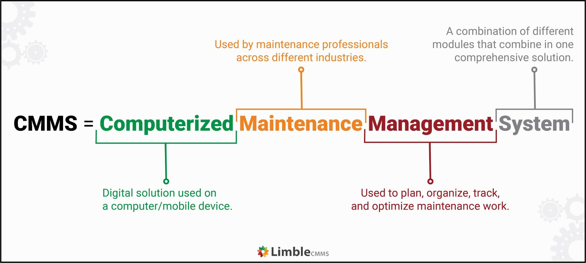

&nbsp;
\newpage


#### Examples of CMMS

- **MaintainX** :

    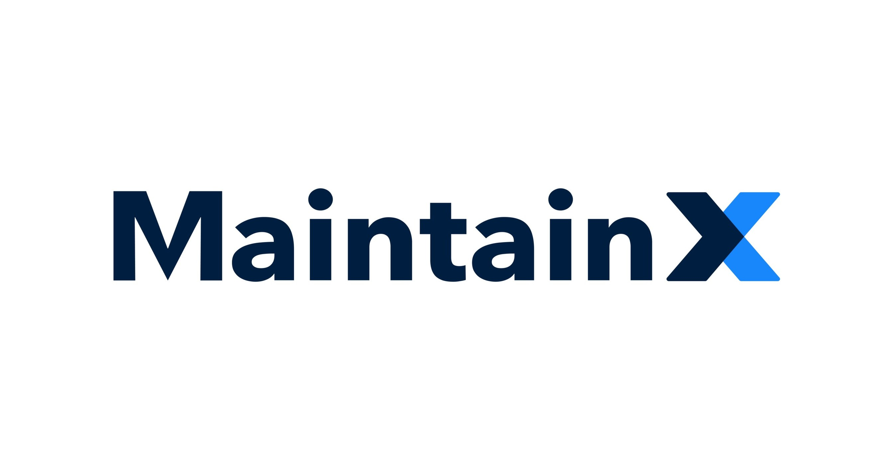

    MaintainX is a CMMS based on a mobile application and a web platform that aims to simplify the maintenance process for teams in the field.

    It offers functionalities such as work order creation, asset management, spare parts inventory tracking, preventive maintenance task planning and report generation.

    The mobile application allows technicians to receive real-time notifications, update the status of tasks and upload photos or notes to document interventions.

    The web platform provides managers with a centralised dashboard where they can track the progress of jobs, analyse performance data and generate reports to optimise maintenance processes. [source(04/2024)](https://www.getmaintainx.com/)

    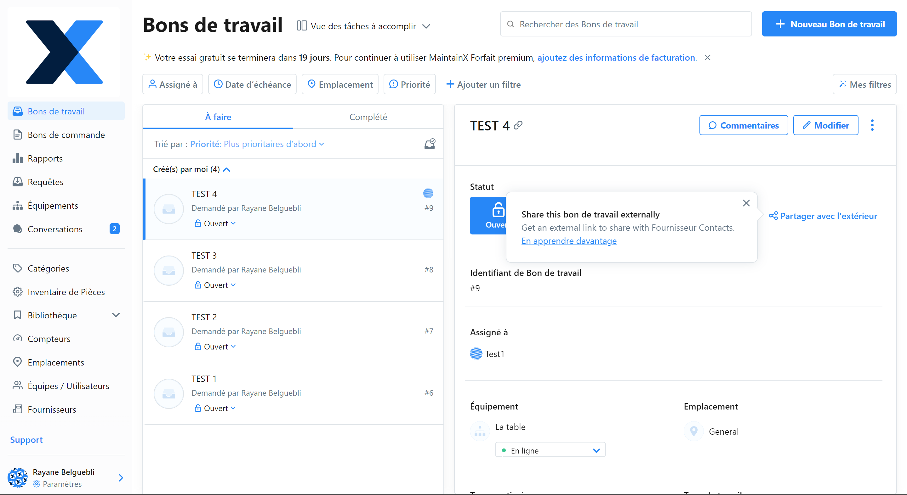

    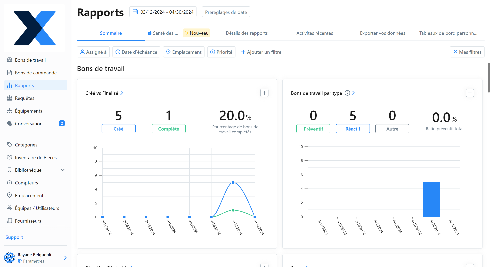

    \newpage

    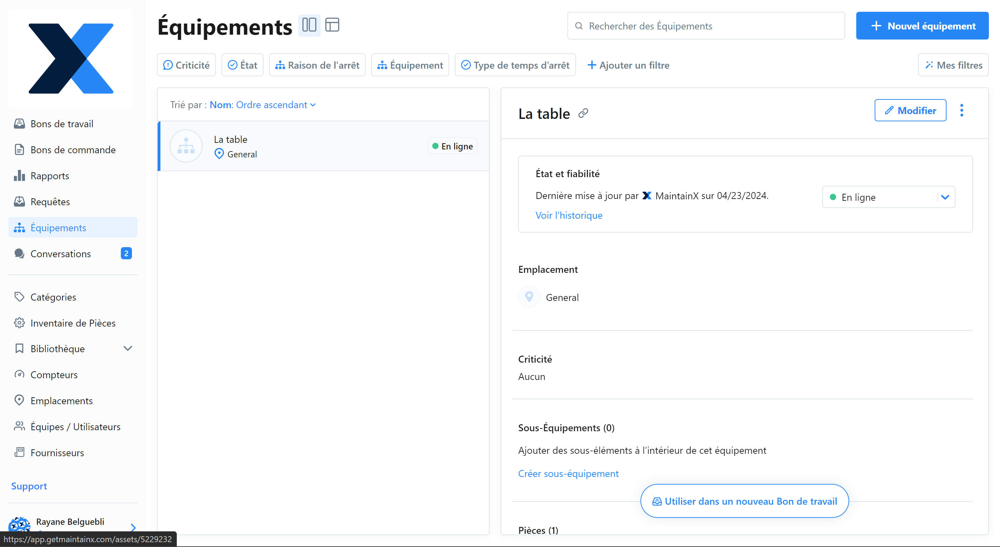

    \newpage

- **Limble** :

    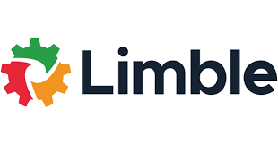

    Limble is also a modern CMMS designed to simplify the management of maintenance activities and extend the life of assets.

    It offers similar functionality to MaintainX, such as work order creation, scheduling, spares management and reporting.

    Limble is distinguished by its user-friendly interface and advanced asset management features, such as equipment hierarchy modelling, warranty management and replacement planning. 

    It also incorporates predictive maintenance and performance dashboard capabilities to help users anticipate breakdowns and make informed decisions to optimise maintenance. [source(04/2024)](https://limblecmms.com/)

    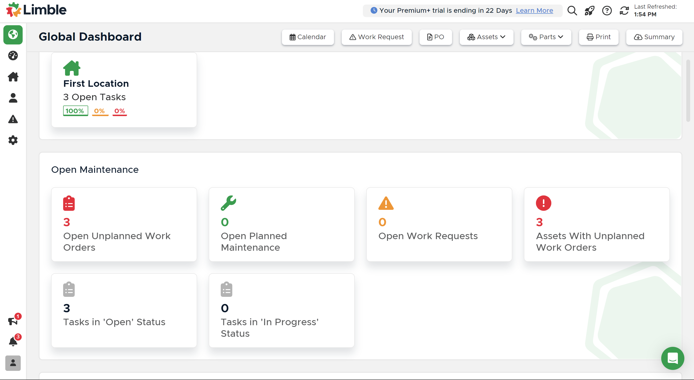

    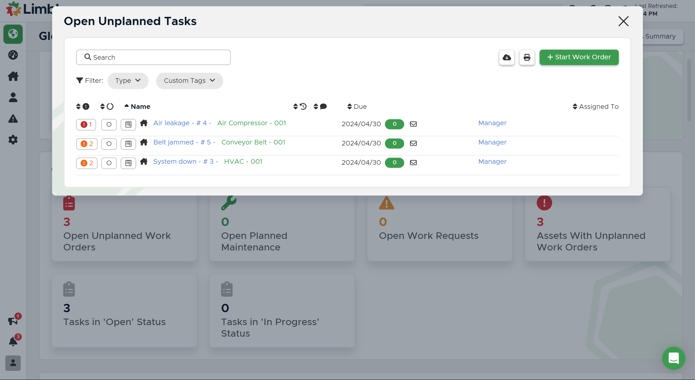

    \newpage

- **Odoo Maintenance**

    

    Odoo is a suite of open source applications covering all your business needs: CRM, eCommerce, Accounting, Inventory, Point of Sale, Project Management, etc. 

    Odoo has a dedicated maintenance section that allows you to manage work orders and assets. Odoo Maintenance is perhaps less advanced than the previous CMMS but is sufficient to solve our problem and above all is free to download. [source(04/2024)](https://www.odoo.com/fr_FR/page/about-us)

    Odoo is based on a 3-tier architecture:

    - a PostgreSQL database server, which can contain several databases ;
    - an application server containing the management objects, workflow engine, editing generator, etc. ;
    - a presentation server that allows users to connect to OpenERP using any Web browser (with the Flash player installed for displaying graphics).
    This last server is not necessary if the user uses the native client, which does require installation on the user's workstation.

    The server part is written in Python. The various building blocks are organised into modules. A module is a folder with a predefined structure containing Python code and XML files. A module defines the data structure, forms, reports, menus, procedures, workflow, etc. [source(04/2024)](https://fr.wikipedia.org/wiki/Odoo#:~:text=La%20partie%20serveur%20est%20%C3%A9crite,Python%20et%20des%20fichiers%20XML.)

    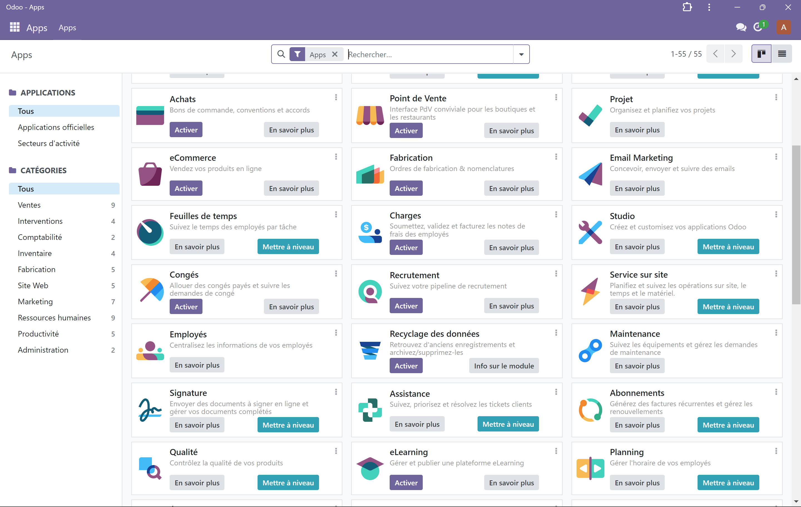

    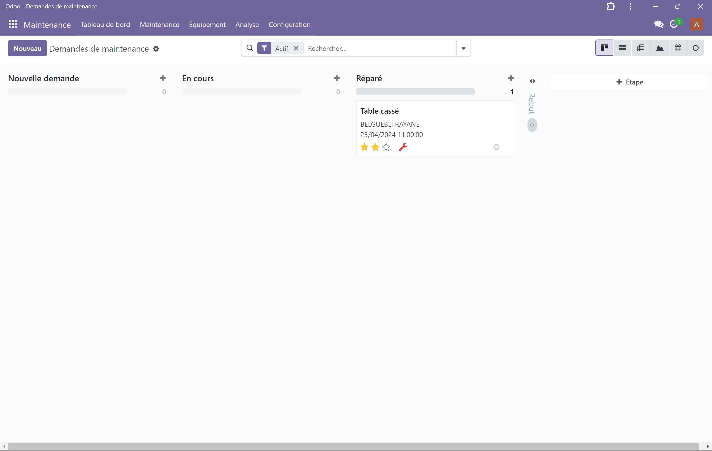

    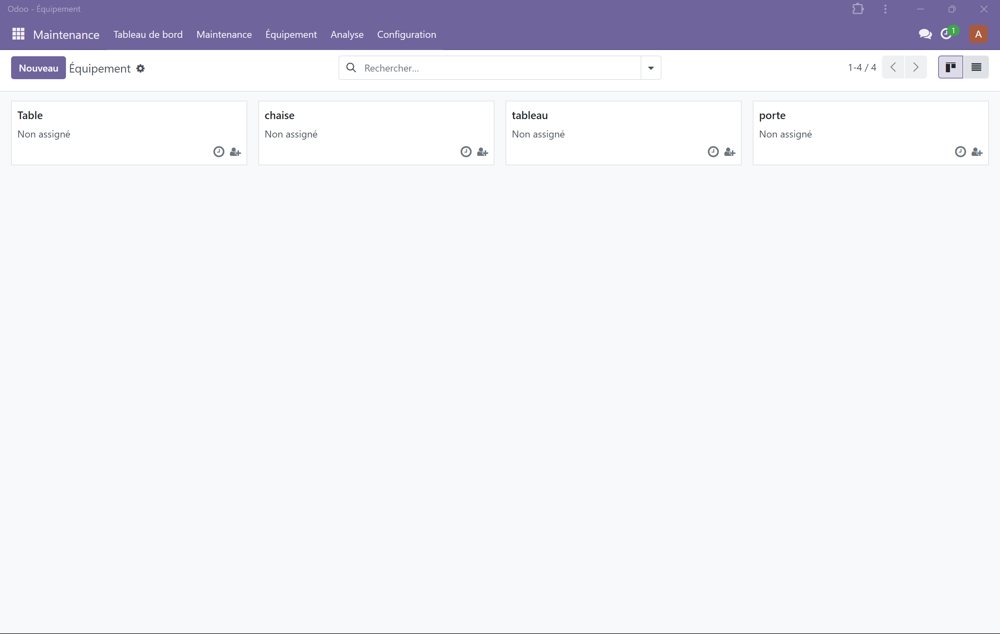

\newpage

##### CMMS comparison

|  | MaintainX | Limble | Odoo |
|-----------|-----------|-----------|-----------|
| Main features | work orders, digital checklists and real-time notifications. | work order, preventive maintenance, asset management and analytical dashboards. |work order management, preventive maintenance planning, asset tracking, spare parts stock management and report generation. |
| User interface | user-friendly mobile interface for fast, efficient communications. | intuitive interface, with simple navigation and clear menus. |user interface is renowned, ease of use and customisation. |
| Prices |paid enterprise version and online community version. | paid enterprise version and online community version. | paid enterprise version and [open source](https://github.com/odoo/odoo) community version. |
| Integration and customisation | MaintainX offers integrations with messaging tools and communication platforms such as Slack, as well as the ability to customise checklists and forms. | asset management systems, accounting software and other productivity tools. | other Odoo applications as well as with third-party software via additional modules. |


\newpage

### What are Maintenance Management Systems?

Maintenance is a critical aspect of any manufacturing or industrial process. It ensures that equipment, machines and facilities operate at their optimum level, avoiding breakdowns and costly downtime. To achieve this, companies need to put in place a well-defined Maintenance Management System (MMS). An MMS is a holistic approach to maintenance management that involves the integration of people, processes and technology to optimise maintenance activities.

The main objective of an MMS is to improve equipment reliability, minimise downtime and increase productivity. It does this by providing a structured approach to maintenance planning, scheduling and execution. This helps maintenance teams to proactively identify and resolve potential problems before they become major issues. By leveraging data, analytics and technology, an MMS enables organisations to optimise maintenance processes, reduce costs and increase asset life. Here are some key points highlighting their importance and benefits :

- **Optimising maintenance operations** : MMS provides a centralised platform for planning, executing and monitoring maintenance activities. This enables efficient resource allocation, priority management and coordination of maintenance teams.

- **Reduced unplanned downtime** : By enabling preventive and predictive maintenance, MMS helps to identify and resolve problems before they become major breakdowns. This reduces unplanned downtime and minimises production interruptions.

- **Extended equipment life** : By providing regular, preventive maintenance, MMS helps to extend the life of equipment. By identifying and correcting potential problems at an early stage, MMS reduces wear and tear on assets.

- **Maximising asset availability** : By ensuring that equipment is well maintained and available when needed, MMS maximises asset availability. This enables organisations to maintain productivity and respond effectively to market demand.

In summary, MMS plays a crucial role in optimising maintenance operations, reducing downtime, extending equipment life and maximising asset availability. The above references illustrate the positive impact of MMS in various sectors and highlight their value as strategic tools for asset management and operational performance [@MMS] [[5]](#references).
\newpage

### What is the django framework et and why use this for our web application ?


In our project to create an innovative web platform that acts as a management centre for maintenance tasks, Django proved to be a wise choice for several key reasons :

- **MVC/MVT structure adapted to our architecture** : 
    Django follows the MVT model, which is a variant of the MVC model. This architecture is particularly well-suited to our project because it allows us to clearly separate the different responsibilities of our application.

    - The Model represents data from the CMMS, such as maintenance task details, equipment information, schedules, etc.

    - The Template is responsible for presenting the data to technicians. In our case, this means generating content adapted to augmented reality for display on their glasses.

    - The View manages the business logic of our application, including the integration of data from the CMMS with augmented reality functionalities to provide technicians with precise, interactive instructions.

- **Managing complex data with Django's ORM** : 
    Django's ORM (Object-Relational Mapping) is one of its most powerful and popular features. It greatly simplifies data manipulation by allowing developers to interact with the database using Python objects rather than direct SQL queries. Here are some key aspects of Django's ORM and why it's beneficial for our project:

    - **Database abstraction** :
        Django's ORM provides a high-level abstraction of the database, meaning developers don't need to worry about the specific details of the underlying database (such as the type of database used or the SQL language).

        This allows Django applications to be developed in a more portable way, as the code can be easily adapted to different types of database without having to change the business logic.

    - **Using Python objects to represent data** :
        Database tables are represented by Python classes called "models" in Django. Each model defines the table's fields and relationships with other models.

        For example, in our project, we might have a Task model to represent the various maintenance tasks, with fields such as description, start date, end date, status, etc.

    - **Easy data manipulation** :
        Once models are defined, CRUD (Create, Read, Update, Delete) operations can be performed using simple and intuitive methods on model objects.

        For example, to create a new task in our project, we would simply create an instance of the Task class, assign it the appropriate values for its fields, and then call the save() method to save it in the database.

    - **Transparent management of relationships between tables** :
        Django's ORM makes it easy to define relationships between models, such as foreign keys and many-to-many relationships.

        For example, in our project, a task could be linked to a specific piece of equipment. This relationship can be easily defined in the Task model by adding a foreign key field that points to the Equipment model.

    - **Protection against SQL injections** :
        Using Django's ORM provides built-in protection against SQL injections, as queries are securely generated using query parameters, preventing SQL injection attacks.

        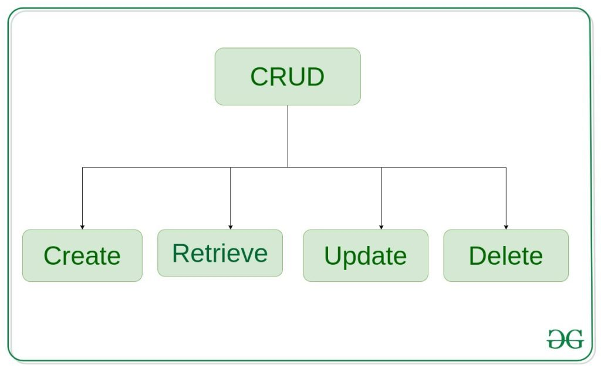

- **Flexible presentation of AR data** :
    Django has a flexible template system that allows dynamic content to be generated for a variety of devices, including augmented reality glasses.

    Templates can be customised to deliver instructions interactively, displaying details of maintenance tasks directly in the technicians' field of vision, improving their productivity and accuracy.

- **Security and scalability**:
    Security is a major concern, especially when it comes to handling sensitive data such as that associated with industrial maintenance. Django incorporates robust security features, such as protection against SQL injections and CSRF attacks, to ensure the security of user data.

    In addition, Django is known for its ability to manage large-scale web applications efficiently. Its scalability will enable our platform to grow with the addition of new features and larger volumes of data.

In short, Django offers a combination of powerful features, built-in security and flexibility that make it the ideal choice for our maintenance task management platform project incorporating augmented reality. Its MVC/MVT architecture, robust ORM and flexible templating system ensure that our solution can be implemented efficiently and scalably.

\newpage

## Chapter 3

### Requirements

#### Use Case 

&nbsp;

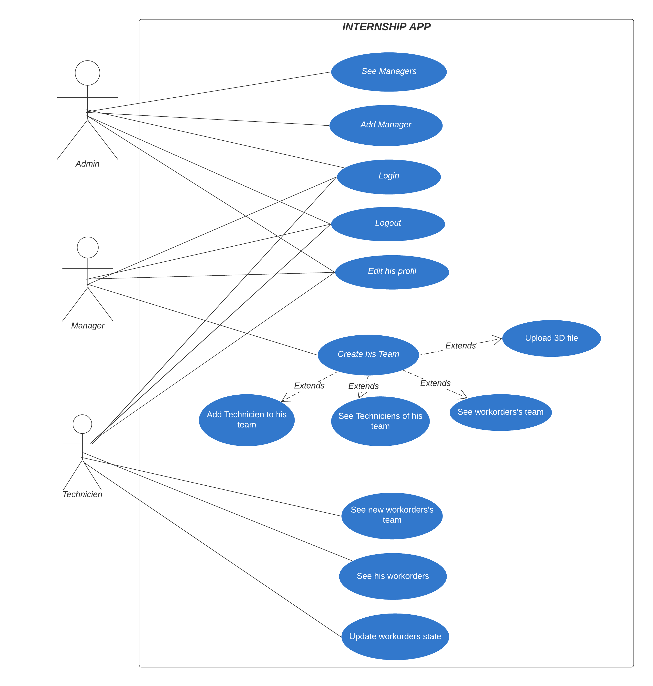

\newpage

#### Description of uses cases


#### Non-Functional Requirements

- Performance:
    The backend system should be highly performant and scalable to handle a large number of concurrent users and data requests.
    Optimize database queries and data processing to minimize response times and maintain overall application responsiveness.

- Security:
    Implement robust security measures to protect sensitive data, including encryption of data at rest and in transit.

- Maintainability:
    Employ modular and well-documented code to facilitate easy understanding, modification, and maintenance of the backend system.

\newpage

### External API Odoo

**Connection**

```py
url = <insert server URL>
db = <insert database name>
username = 'admin'
password = <insert password for your admin user (default: admin)>
```

**GET**

```py
models.execute_kw(db, uid, password, 'res.users', 'search_read', [[]], {'fields': []})
```

**PATCH**

```py
models.execute_kw(
        db, uid, password,
        'maintenance.request', 'write',
        [[33], {'schedule_date': formatted_now}]
    )
```

**CREATE**

```py
new_user_data = {
    'name': "signup_username",
    'login': "signup_email",
    'password': "signup_password",
}
models.execute_kw(db, uid, password, 'res.users', 'create', [new_user_data])
```

**DELETE**

```py
models.execute_kw(db, uid, password, 'res.users', 'unlink', [[2]])
```

[source (05/2024)](https://www.odoo.com/documentation/17.0/fr/developer/reference/external_api.html)

\newpage

### Database

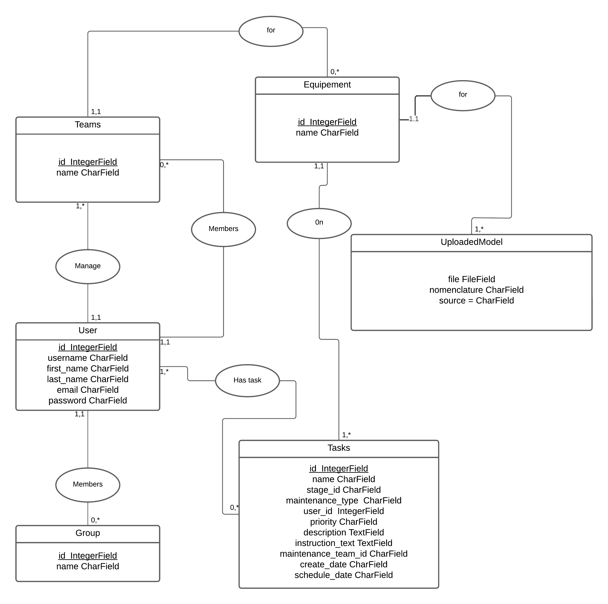

## References

::: {#refs}
:::
